>  **从零学golang全集** | 🔍**最值得学习的Go项目集合** | 🎯 **企业级代码规范** | 🚀 **附多课网深度解析教程**  
>
>  本仓库精选**生产环境验证**的Go项目，每个项目提供：  
>
>  - ✅ 可运行的**完整代码**（非Demo片段）  
>  - 📚 配套[视频教程](https://www.duoke360.com/go)与**设计文档**  
>  - 💡 行业应用场景分析（如高并发/区块链等）  


以下是针对Go语言基础教程的优化整理方案，采用模块化结构，便于学习和快速查阅：

---

# 🚀 Go语言系统化教程

## 📌 核心模块概览

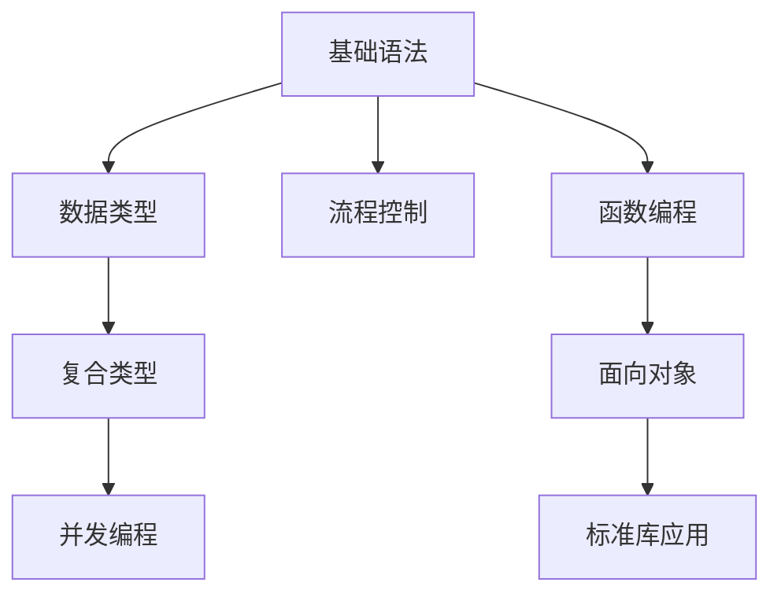

## 一、🔧 开发准备

| 主题     | 链接                                                        | 要点                  |
| -------- | ----------------------------------------------------------- | --------------------- |
| 环境搭建 | [安装指南](https://duoke360.com/tutorial/golang/install)    | 多平台配置/版本管理   |
| 工具链   | [开发工具](https://duoke360.com/tutorial/golang/tools)      | VS Code配置/Delve调试 |
| 工程管理 | [Go Module](https://duoke360.com/tutorial/golang/go-module) | 依赖管理/私有仓库     |

**常用命令速查**：

```bash
go mod init   # 初始化模块
go test -v    # 执行测试
go build -o   # 指定输出
```

## 二、📐 基础语法

### 1. 核心概念

- [变量与常量](https://duoke360.com/tutorial/golang/var) - `:=`语法糖/类型推断
- [运算符](https://duoke360.com/tutorial/golang/go-operator) - 指针运算/位操作

### 2. 数据类型

| 类型   | 教程链接                                                | 示例                      |
| ------ | ------------------------------------------------------- | ------------------------- |
| 字符串 | [strings](https://duoke360.com/tutorial/golang/strings) | `strings.Builder`高效拼接 |
| 切片   | [slice](https://duoke360.com/tutorial/golang/go-slice)  | 内存布局/扩容机制         |
| Map    | [map](https://duoke360.com/tutorial/golang/golang-map)  | 并发安全方案              |

## 三、🔄 流程控制

### 分支结构

```go
// 模式匹配示例
switch os := runtime.GOOS; os {
case "darwin":
    fmt.Println("MacOS")
default:
    fmt.Printf("%s.\n", os)
}
```

- [if-else最佳实践](https://duoke360.com/tutorial/golang/go-if-else)
- [switch进阶](https://duoke360.com/tutorial/golang/go-switch) - 类型断言

### 循环控制

- [for-range陷阱](https://duoke360.com/tutorial/golang/go-for-range) - 值拷贝问题
- [break标签](https://duoke360.com/tutorial/golang/go-break) - 跳出多层循环

## 四、🧩 复合类型

### 切片操作矩阵

| 操作 | 方法   | 时间复杂度 |
| ---- | ------ | ---------- |
| 追加 | append | 均摊O(1)   |
| 切割 | s[1:3] | O(1)       |
| 复制 | copy   | O(n)       |

[切片实战](https://duoke360.com/tutorial/golang/slice-append-delete-copy)

## 五、⚡ 并发编程

### Goroutine调度

```go
func worker(id int, jobs <-chan int) {
    for j := range jobs {
        fmt.Printf("worker%d: job%d\n", id, j)
    }
}
// 工作池实现见课程
```

- [GMP模型](https://duoke360.com/tutorial/golang/golang-runtime)
- [Channel原理](https://duoke360.com/tutorial/golang/golang-channel)

### 同步原语

| 工具      | 应用场景 | 教程                                                         |
| --------- | -------- | ------------------------------------------------------------ |
| Mutex     | 共享内存 | [互斥锁](https://duoke360.com/tutorial/golang/golang-mutex)  |
| WaitGroup | 任务编排 | [同步控制](https://duoke360.com/tutorial/golang/golang-waitgroup) |
| Atomic    | 计数器   | [原子操作](https://duoke360.com/tutorial/golang/golang-atomic-detail) |

## 六、📚 标准库精要

### 常用包速查

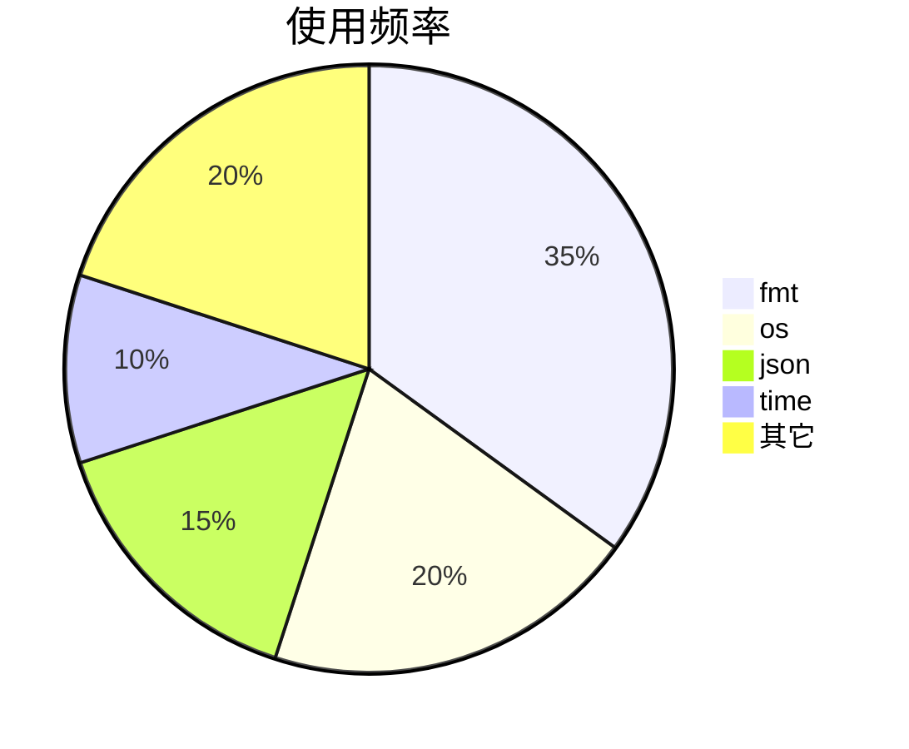

- [JSON处理](https://duoke360.com/tutorial/golang/golang-stdlib-json) - 结构体标签
- [文件操作](https://duoke360.com/tutorial/golang/golang-os-file-read) - 缓冲区优化

## 七、🗃️ 数据库操作

### MySQL实战步骤

1. [驱动配置](https://duoke360.com/tutorial/golang/golang-mysql2)
2. [连接池管理](https://duoke360.com/tutorial/golang/golang-mysql3)
3. [CRUD优化](https://duoke360.com/tutorial/golang/golang-mysql4)

**事务示例**：

```go
tx, _ := db.Begin()
result, _ := tx.Exec("UPDATE users SET balance=? WHERE id=?", newBal, userID)
if affect, _ := result.RowsAffected(); affect == 0 {
    tx.Rollback()
} else {
    tx.Commit()
}
```

以下是针对Go语言算法练习的优化整理方案，采用分类结构+实战代码示例，便于系统化学习：

---

# 🧮 Go语言算法实战大全

## 一、📊 数学计算类

### 1. 基础运算

| 算法         | 链接                                                     | 代码片段                |
| ------------ | -------------------------------------------------------- | ----------------------- |
| 数字排列组合 | [ex1](https://duoke360.com/tutorial/golang-examples/ex1) | `permute([]int{1,2,3})` |
| 完全平方数   | [ex3](https://duoke360.com/tutorial/golang-examples/ex3) | `math.Sqrt(float64(n))` |
| 阶乘计算     | [ex25/ex26](https://ex26)                                | 递归/迭代两种实现       |

```go
// 最大公约数（欧几里得算法）
func gcd(a, b int) int {
    for b != 0 {
        a, b = b, a%b
    }
    return a
}
// [ex16](https://duoke360.com/tutorial/golang-examples/ex16)
```

### 2. 数值分析

- **质数相关**：
  - [素数判断](https://ex12) - 埃拉托斯特尼筛法
  - [质因数分解](https://ex14) - 短除法实现
- **特殊数列**：
  - [水仙花数](https://ex13) - 三位数特例
  - [斐波那契数列](https://ex11) - 兔子问题

## 二、📈 逻辑训练类

### 1. 经典问题

| 问题       | 链接                 | 核心逻辑     |
| ---------- | -------------------- | ------------ |
| 猴子吃桃   | [ex21](https://ex21) | 逆向递推     |
| 自由落体   | [ex20](https://ex20) | 等比数列求和 |
| 乒乓球对手 | [ex22](https://ex22) | 排列组合     |

### 2. 日期处理

```go
// 计算一年中的第几天 [ex4]
func dayOfYear(year int, month int, day int) int {
    d := time.Date(year, time.Month(month), day, 0, 0, 0, 0, time.UTC)
    return d.YearDay()
}
```

## 三、🎨 图形输出类

### 1. 基础图案

| 图形 | 链接                 | 关键技术    |
| ---- | -------------------- | ----------- |
| 菱形 | [ex23](https://ex23) | 对称控制    |
| 楼梯 | [ex10](https://ex10) | 嵌套循环    |
| 棋盘 | [ex9](https://ex9)   | Unicode字符 |

```go
// 乘法口诀表 [ex8]
for i := 1; i <= 9; i++ {
    for j := 1; j <= i; j++ {
        fmt.Printf("%d×%d=%-2d ", j, i, i*j)
    }
    fmt.Println()
}
```

### 2. 高级图案

- [特殊图案](https://ex7) - ASCII艺术
- [图形变换](https://ex6) - 动态调整参数

## 四、🎲 实用算法类

### 1. 数据处理

| 算法     | 链接                                     | 应用场景 |
| -------- | ---------------------------------------- | -------- |
| 洗牌算法 | [go-shuffle](https://go-shuffle)         | 随机排序 |
| 抢红包   | [go-get-red-pkg](https://go-get-red-pkg) | 金额分配 |
| 逆序数字 | [ex29](https://ex29)                     | 数字处理 |

```go
// 回文数判断 [ex30]
func isPalindrome(x int) bool {
    if x < 0 { return false }
    original, reversed := x, 0
    for x > 0 {
        reversed = reversed*10 + x%10
        x /= 10
    }
    return original == reversed
}
```

### 2. 字符串操作

- [字符统计](https://ex17) - Unicode处理
- [倒序输出](https://ex27) - rune切片反转

## 五、📚 学习建议

1. **每日一题**：从简单算法开始（如[ex5数字排序](https://ex5)）

2. **分类突破**：

   ```mermaid
   graph LR
   A[数学类] --> B[图形类]
   A --> C[逻辑类]
   C --> D[实际应用]
   ```

3. **实战技巧**：

   - 使用`testing`包编写测试用例
   - 对比不同算法的时间复杂度（如[ex19完数判断](https://ex19)优化）

# Go语言设计模式

### 一、创建型模式

1. **单例模式**  
   - 保证全局唯一实例，如数据库连接池  
   - 实现方式：`sync.Once`懒汉式、饿汉式  
   - 课程链接：[单例模式](https://duoke360.com/tutorial/design-pattern/dp-singleton)

2. **工厂模式**  
   - 简单工厂：通过参数控制对象创建  
   - 抽象工厂：创建产品族（如不同品牌的电器）  
   - 案例：Nike/Adidas鞋类生产  
   - 课程链接：[工厂模式](https://duoke360.com/tutorial/design-pattern/dp-factory)

3. **建造者模式**  
   - 分步构建复杂对象（如SQL查询构造器）  
   - 课程链接：[建造者模式](https://duoke360.com/tutorial/design-pattern/dp-builder)

---

### 二、结构型模式

1. **适配器模式**  
   - 接口转换（如旧系统兼容新协议）  
   - 课程链接：[适配器模式](https://duoke360.com/tutorial/design-pattern/golang-adapter)

2. **装饰器模式**  
   - 动态添加功能（如HTTP中间件）  
   - 课程链接：[装饰器模式](https://duoke360.com/tutorial/design-pattern/dp-decorator)

3. **代理模式**  
   - 控制对象访问（如缓存代理）  
   - 课程链接：[代理模式](https://duoke360.com/tutorial/design-pattern/dp-proxy)

---

### 三、行为型模式

1. **观察者模式**  
   - 事件通知系统（如订单状态更新）  
   - 核心：`Subject`维护`Observer`列表  
   - 课程链接：[观察者模式](https://duoke360.com/tutorial/design-pattern/dp-observer)

2. **命令模式**  
   - 封装操作为对象（支持撤销/重做）  
   - 案例：电视机遥控器指令  
   - 课程链接：[命令模式](https://duoke360.com/tutorial/design-pattern/dp-command)

3. **责任链模式**  
   - 请求流水线处理（如审批流程）  
   - 课程链接：[责任链模式](https://duoke360.com/tutorial/design-pattern/dp-chain)

---

### 四、并发相关模式

| 模式       | 解决痛点             | Go特性应用          |
| ---------- | -------------------- | ------------------- |
| 单例模式   | 全局资源竞争         | `sync.Once`原子操作 |
| 观察者模式 | 事件并发通知         | Channel实现订阅发布 |
| 享元模式   | 减少重复对象内存占用 | 对象池+`sync.Pool`  |

---

### 五、完整学习路径建议

1. **基础阶段**：单例→工厂→装饰器  
2. **进阶阶段**：观察者→命令→责任链  
3. **项目实战**：结合`context`包实现中间件链

> 完整课程体系：[设计模式专题](https://duoke360.com/tutorial/design-pattern)


# 🧠 Go语言数据结构与算法精要

## 一、📐 数据结构基础

### 1. 结构分类

| 类型     | 特点               | 应用场景          | 教程链接                                                   |
| -------- | ------------------ | ----------------- | ---------------------------------------------------------- |
| **数组** | 连续内存、固定大小 | 高频随机访问      | [常见数据结构](https://duoke360.com/tutorial/ds/ds-common) |
| **链表** | 动态增长、指针连接 | 频繁插入删除      | [链表实现](https://duoke360.com/tutorial/ds/ds-linkedlist) |
| **栈**   | LIFO原则           | 函数调用/撤销操作 | [栈实现](https://duoke360.com/tutorial/ds/ds-stack)        |

```go
// 链表节点定义示例
type Node struct {
    Value int
    Next  *Node
}
```

### 2. 标准库应用

- [container/list](https://duoke360.com/tutorial/ds/ds-container-list) - 双向链表实现
- [sort包](https://duoke360.com/tutorial/ds/ds-sort-pkg) - 内置排序接口

## 二、⚡ 排序算法

### 性能对比表

| 算法     | 平均时间复杂度 | 空间复杂度 | 稳定性 | 实现链接                                               |
| -------- | -------------- | ---------- | ------ | ------------------------------------------------------ |
| 冒泡排序 | O(n²)          | O(1)       | 稳定   | [冒泡排序](https://duoke360.com/tutorial/ds/ds-bubble) |
| 快速排序 | O(nlogn)       | O(logn)    | 不稳定 | [快速排序](https://duoke360.com/tutorial/ds/ds-quick)  |
| 归并排序 | O(nlogn)       | O(n)       | 稳定   | [归并排序](https://duoke360.com/tutorial/ds/ds-merge)  |

```go
// 快速排序Go实现
func QuickSort(arr []int) []int {
    if len(arr) <= 1 {
        return arr
    }
    pivot := arr[0]
    var left, right []int
    for _, v := range arr[1:] {
        if v < pivot {
            left = append(left, v)
        } else {
            right = append(right, v)
        }
    }
    left = QuickSort(left)
    right = QuickSort(right)
    return append(append(left, pivot), right...)
}
```

## 三、🔍 搜索算法

### 1. 二分查找

- 要求：**有序数组**
- 时间复杂度：O(logn)
- [实现教程](https://duoke360.com/tutorial/ds/ds-binary-search)

```go
func BinarySearch(arr []int, target int) int {
    low, high := 0, len(arr)-1
    for low <= high {
        mid := low + (high-low)/2
        if arr[mid] == target {
            return mid
        } else if arr[mid] < target {
            low = mid + 1
        } else {
            high = mid - 1
        }
    }
    return -1
}
```

### 2. 树结构搜索

- [二叉搜索树](https://duoke360.com/tutorial/ds/ds-tree) - 左小右大特性
- 平衡二叉树优化方案（AVL/红黑树）

## 四、📊 复杂度分析

| 概念       | 定义             | 示例              | 教程                                                         |
| ---------- | ---------------- | ----------------- | ------------------------------------------------------------ |
| 时间复杂度 | 执行时间增长趋势 | O(1)<O(logn)<O(n) | [复杂度分析](https://duoke360.com/tutorial/ds/ds-time-space) |
| 空间复杂度 | 内存占用增长趋势 | 递归调用栈空间    | 同上                                                         |

## 五、🎯 学习路径

1. **基础阶段**：数组 → 链表 → 栈/队列
2. **算法入门**：冒泡排序 → 插入排序 → 二分查找
3. **进阶提升**：快速排序 → 归并排序 → 二叉搜索树
4. **工程实践**：标准库应用 → 性能优化

> 完整代码示例：[多课网算法仓库](https://duoke360.com/tutorial/ds)


# 🚀 Go语言高频问题权威指南

## 一、🔧 基础语法疑难

### 1. 结构体与JSON

| 问题         | 解决方案                     | 示例                                | 链接                                               |
| ------------ | ---------------------------- | ----------------------------------- | -------------------------------------------------- |
| JSON输出为空 | 字段首字母大写/添加tag       | ```go `json:"name"` ```             | [Q1](https://duoke360.com/tutorial/golang-qa/q1)   |
| 动态解析JSON | 使用`map[string]interface{}` | ```json.Unmarshal(data, &result)``` | [Q10](https://duoke360.com/tutorial/golang-qa/q10) |

```go
type User struct {
    Name string `json:"name"` // 必须导出字段
    Age  int    `json:"age"`
}
```

### 2. 指针与值

| 场景       | 使用建议       | 典型问题       |
| ---------- | -------------- | -------------- |
| 参数传递   | 大结构体用指针 | 值拷贝性能损耗 |
| 方法接收者 | 需修改用指针   | 方法集差异     |

## 二、💡 高级特性

### 1. 并发编程

| 问题            | 关键点         | 解决方案           |
| --------------- | -------------- | ------------------ |
| Goroutine无输出 | 主线程提前退出 | `sync.WaitGroup`   |
| Map并发安全     | 读写冲突       | `sync.Map`/`Mutex` |

```go
var wg sync.WaitGroup
wg.Add(1)
go func() {
    defer wg.Done()
    fmt.Println("Hello")
}()
wg.Wait()
```

### 2. 面向对象

| 特性     | Go实现方式   | 参考链接                                           |
| -------- | ------------ | -------------------------------------------------- |
| 多态     | 接口隐式实现 | [Q19](https://duoke360.com/tutorial/golang-qa/q19) |
| 构造方法 | 工厂函数模式 | [Q23](https://duoke360.com/tutorial/golang-qa/q23) |

## 三、🛠 工程实践

### 1. 数据库操作

| ORM框架  | 特点         | 适用场景 | 对比                                               |
| -------- | ------------ | -------- | -------------------------------------------------- |
| GORM     | 全功能       | 复杂业务 | [Q16](https://duoke360.com/tutorial/golang-qa/q16) |
| XORM     | 高性能       | 简单CRUD | 同上                                               |
| 钩子函数 | 生命周期控制 | 审计日志 | [Q18](https://duoke360.com/tutorial/golang-qa/q18) |

### 2. 系统设计

| 挑战         | 解决方案            | 案例                                             |
| ------------ | ------------------- | ------------------------------------------------ |
| 全局变量管理 | `internal`包+init() | [Q9](https://duoke360.com/tutorial/golang-qa/q9) |
| 优雅设计     | 分层架构            | [Q2](https://duoke360.com/tutorial/golang-qa/q2) |

## 四、📌 高频技巧

### 1. 实用代码片段

```go
// 检查map键是否存在 [Q24]
if val, ok := m["key"]; ok {
    fmt.Println(val)
}

// 整型转字符串 [Q25]
str := strconv.Itoa(123)
```

### 2. 易错点警示

| 问题     | 错误示例     | 正确写法                    |
| -------- | ------------ | --------------------------- |
| 类型断言 | `x.(string)` | `s, ok := x.(string)` [Q13] |
| 泛型约束 | `T.Method()` | 定义接口约束 [Q21]          |

## 五、🎯 学习路径

1. **新手必看**：Q1→Q3→Q6→Q24
2. **进阶提升**：Q5→Q7→Q14→Q19
3. **架构设计**：Q2→Q8→Q16→Q23

> 完整问题库：[Go语言问答集合](https://duoke360.com/tutorial/golang-qa)


# 🚀 Go语言并发编程完全指南

## 一、🛠️ 并发基础

### 1. 核心概念对比

| 概念            | 特点          | Go实现      | 链接                                                         |
| --------------- | ------------- | ----------- | ------------------------------------------------------------ |
| 协程(Goroutine) | 轻量级(2KB栈) | `go func()` | [创建](https://duoke360.com/tutorial/concurrent/create-goroutine) |
| 线程            | 系统级调度    | runtime管理 | [对比](https://duoke360.com/tutorial/concurrent/porcess-thread-goroutine) |
| 并发vs并行      | 逻辑vs物理    | GMP模型     | [详解](https://duoke360.com/tutorial/concurrent/parallel-concurrency) |

```go
// 启动百万级协程示例
for i := 0; i < 1e6; i++ {
    go func(id int) {
        fmt.Printf("Goroutine %d\n", id)
    }(i)
}
```

## 二、📡 通信机制

### 1. Channel深度解析

| 类型   | 特点     | 应用场景 | 教程                                                         |
| ------ | -------- | -------- | ------------------------------------------------------------ |
| 无缓冲 | 同步阻塞 | 精确控制 | [基础](https://duoke360.com/tutorial/concurrent/channel)     |
| 有缓冲 | 异步队列 | 流量控制 | [缓冲](https://duoke360.com/tutorial/concurrent/buffered-channel) |
| select | 多路复用 | 超时处理 | [选择器](https://duoke360.com/tutorial/concurrent/channel-select) |

```go
// 生产者-消费者模式
ch := make(chan int, 10)
go func() { // Producer
    for i := 0; ; i++ {
        ch <- i
    }
}()
go func() { // Consumer
    for n := range ch {
        fmt.Println(n)
    }
}()
```

### 2. 高级通信模式

- [Timer/Ticker](https://duoke360.com/tutorial/concurrent/timer) - 定时任务
- [Context](https://duoke360.com/tutorial/concurrent/context) - 跨协程控制
- [sync.Once](https://duoke360.com/tutorial/concurrent/sync-once) - 单例实现

## 三、🔒 同步原语

### 1. 锁机制对比

| 锁类型  | 特点     | 适用场景 | 性能     |
| ------- | -------- | -------- | -------- |
| Mutex   | 互斥访问 | 写多读少 | 300ns/op |
| RWMutex | 读写分离 | 读多写少 | 50ns/读  |
| Atomic  | 无锁操作 | 计数器   | 5ns/op   |

```go
var counter int64
// 原子操作
atomic.AddInt64(&counter, 1)
```

### 2. 同步模式

| 模式      | 实现方案 | 案例     | 链接                                                         |
| --------- | -------- | -------- | ------------------------------------------------------------ |
| WaitGroup | 任务编排 | 批量处理 | [教程](https://duoke360.com/tutorial/concurrent/WaitGroup)   |
| Cond      | 条件等待 | 资源就绪 | [Broadcast用法](https://duoke360.com/tutorial/concurrent/cbs) |
| Pool      | 对象复用 | 临时对象 | [sync.Pool](https://duoke360.com/tutorial/concurrent/sync-pool) |

## 四、⚠️ 并发陷阱

### 1. 死锁场景

| 类型       | 案例     | 解决方案       | 参考                                                         |
| ---------- | -------- | -------------- | ------------------------------------------------------------ |
| 互斥锁嵌套 | 重复加锁 | 锁粒度拆分     | [案例1](https://duoke360.com/tutorial/concurrent/dead-lock1) |
| 通道阻塞   | 无接收者 | select+default | [案例3](https://duoke360.com/tutorial/concurrent/dead-lock3) |

### 2. 内存模型

- [可见性问题](https://duoke360.com/tutorial/concurrent/visible) - happens-before原则
- [不可变对象](https://duoke360.com/tutorial/concurrent/immutable-obj) - 并发安全设计

## 五、🏗️ 高级模式

### 1. 并发架构

| 模式        | 实现要点    | 性能优化   | 教程                                                         |
| ----------- | ----------- | ---------- | ------------------------------------------------------------ |
| Worker Pool | 限制并发数  | 动态扩缩容 | [协程池](https://duoke360.com/tutorial/concurrent/pool2)     |
| Pub/Sub     | Channel组合 | 扇出模式   | [生产者消费者](https://duoke360.com/tutorial/concurrent/producer-consumer) |

### 2. 底层原理

- [GMP调度模型](https://duoke360.com/tutorial/concurrent/gmp) - 工作窃取算法
- [sync.Map](https://duoke360.com/tutorial/concurrent/sync-map) - 读多写少优化

## 📚 学习路径

1. **基础阶段**：Goroutine → Channel → WaitGroup
2. **进阶提升**：Mutex → Atomic → Context
3. **系统设计**：Worker Pool → Pub/Sub → 性能调优

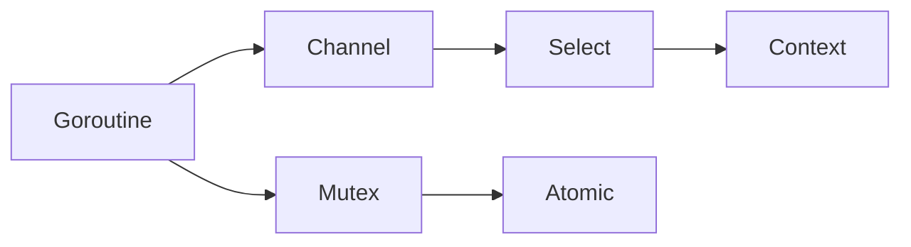

> 完整代码示例：[并发编程实战](https://duoke360.com/tutorial/concurrent)


# 🏗️ GORM 全栈开发指南

## 一、🚀 快速入门

### 1. 核心特性

| 特性      | 优势               | 适用场景     |
| --------- | ------------------ | ------------ |
| 全功能ORM | 支持CRUD/事务/关联 | 业务系统开发 |
| 链式调用  | 直观的查询构建     | 复杂查询     |
| 钩子函数  | 生命周期控制       | 审计日志     |

```go
import "gorm.io/gorm"
// [基本配置](https://duoke360.com/tutorial/gorm/connect-db)
db, err := gorm.Open(mysql.Open(dsn), &gorm.Config{})
```

## 二、📐 数据建模

### 1. 模型定义

```go
type User struct {
    gorm.Model        // 内嵌通用字段
    Name      string `gorm:"type:varchar(100);uniqueIndex"`
    Age       int    `gorm:"default:18"`
    Profile   Profile `gorm:"foreignKey:UserID"` // [Has One](https://duoke360.com/tutorial/gorm/gorm-has-one)
}
// [模型声明](https://duoke360.com/tutorial/gorm/gorm-model)
```

### 2. 关系映射

| 关系类型   | GORM实现            | 示例                                                       |
| ---------- | ------------------- | ---------------------------------------------------------- |
| Belongs To | `User`属于`Company` | [教程](https://duoke360.com/tutorial/gorm/gorm-belongs-to) |
| Many2Many  | 自动生成中间表      | [多对多](https://duoke360.com/tutorial/gorm/many-to-many)  |

## 三、🔍 查询艺术

### 1. 基础查询

```go
// [条件查询](https://duoke360.com/tutorial/gorm/query-recored)
db.Where("age > ?", 20).Find(&users)

// 预加载关联
db.Preload("Orders").First(&user)
```

### 2. 高级技巧

| 功能   | 方法链             | 说明     |
| ------ | ------------------ | -------- |
| 分页   | `Limit().Offset()` | 列表查询 |
| 锁     | `Clauses()`        | 悲观锁   |
| 子查询 | `SubQuery()`       | 复杂统计 |

```go
// [SQL构建器](https://duoke360.com/tutorial/gorm/sql-builder)
db.Select("AVG(age) as avg_age").Group("name").Having("AVG(age) > ?", 20)
```

## 四、⚙️ 数据操作

### CRUD操作矩阵

| 操作 | 方法       | 关联处理   | 教程                                                         |
| ---- | ---------- | ---------- | ------------------------------------------------------------ |
| 创建 | `Create()` | 级联创建   | [创建记录](https://duoke360.com/tutorial/gorm/create-record) |
| 更新 | `Save()`   | 选择性更新 | [更新](https://duoke360.com/tutorial/gorm/gorm-update)       |
| 删除 | `Delete()` | 软删除     | [删除](https://duoke360.com/tutorial/gorm/gorm-delete)       |

## 五、🏦 事务管理

### 事务模式对比

| 方式     | 优点     | 适用场景   |
| -------- | -------- | ---------- |
| 自动事务 | 简洁     | 简单操作   |
| 手动事务 | 灵活控制 | 跨模型操作 |

```go
// [事务处理](https://duoke360.com/tutorial/gorm/gorm-trans)
db.Transaction(func(tx *gorm.DB) error {
    if err := tx.Create(&user).Error; err != nil {
        return err
    }
    return tx.Create(&order).Error
})
```

## 六、🔐 性能优化

### 1. 最佳实践

| 场景     | 优化方案          | 效果     |
| -------- | ----------------- | -------- |
| 批量插入 | `CreateInBatches` | 提升10x  |
| 查询优化 | `Select`指定字段  | 减少IO   |
| 连接池   | `SetMaxOpenConns` | 控制资源 |

### 2. 调试技巧

```go
// 查看SQL日志
db.Debug().Where("name = ?", "jinzhu").First(&user)
```

## 📚 学习路径

1. **基础阶段**：模型定义 → CRUD操作 → 简单查询
2. **进阶提升**：关联查询 → 事务控制 → 原生SQL
3. **高手之路**：性能优化 → 插件开发 → 分库分表

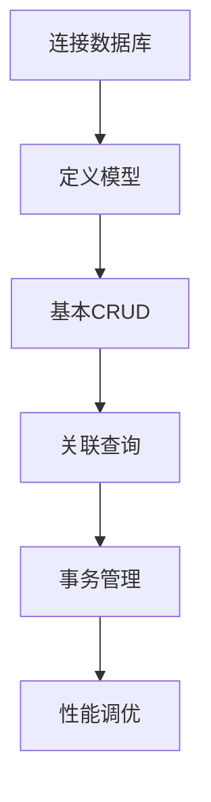

> 完整教程：[GORM实战总结](https://duoke360.com/tutorial/gorm)

# 🔍 Go语言源码深度解析指南

## 一、📦 核心包解析

### 1. 基础类型系统

| 包      | 核心实现     | 关键技巧       | 源码链接                                                     |
| ------- | ------------ | -------------- | ------------------------------------------------------------ |
| builtin | 内建类型定义 | 编译器特殊处理 | [builtin.go](https://duoke360.com/tutorial/golang-src/golang-src-builtin.go) |
| reflect | 运行时反射   | 类型元信息获取 | [reflect包](https://duoke360.com/tutorial/golang-src/reflect) |

```go
// reflect.TypeOf 底层实现
func TypeOf(i interface{}) Type {
    eface := *(*emptyInterface)(unsafe.Pointer(&i))
    return toType(eface.typ)
}
```

### 2. 字符串处理

| 组件            | 优化策略 | 性能对比     | 源码                                                         |
| --------------- | -------- | ------------ | ------------------------------------------------------------ |
| strings.Builder | 零拷贝   | 比`+`快10x   | [builder.go](https://duoke360.com/tutorial/golang-src/strings-builder) |
| bytes.Buffer    | 池化技术 | 减少内存分配 | [buffer.go](https://duoke360.com/tutorial/golang-src/buffer) |

## 二、🚀 并发原理解析

### 1. 同步机制

| 组件       | 实现原理    | 适用场景   | 源码分析                                                     |
| ---------- | ----------- | ---------- | ------------------------------------------------------------ |
| sync.Mutex | 自旋+信号量 | 短期锁竞争 | [mutex.go](https://duoke360.com/tutorial/golang-src/sync-mutex) |
| sync.Map   | 读写分离    | 读多写少   | [map.go](https://duoke360.com/tutorial/golang-src/sync-map)  |
| atomic     | CPU指令级   | 计数器场景 | [value.go](https://duoke360.com/tutorial/golang-src/atomic-value) |

### 2. 并发模式

```go
// sync.Once 经典实现
type Once struct {
    done uint32
    m    Mutex
}

func (o *Once) Do(f func()) {
    if atomic.LoadUint32(&o.done) == 0 {
        o.doSlow(f)
    }
}
// [源码分析](https://duoke360.com/tutorial/golang-src/sync-once)
```

## 三、🌐 网络与IO

### 1. HTTP服务核心

| 组件           | 关键设计   | 性能优化点     | 源码                                                         |
| -------------- | ---------- | -------------- | ------------------------------------------------------------ |
| http.Server    | 连接池管理 | Keep-Alive复用 | [server.go](https://duoke360.com/tutorial/golang-src/net-http-server) |
| http.Transport | 连接控制   | 并发度限制     | [client.go](https://duoke360.com/tutorial/golang-src/net-http-client) |

### 2. IO优化策略

| 包      | 缓冲策略 | 零拷贝技术   | 分析链接                                                    |
| ------- | -------- | ------------ | ----------------------------------------------------------- |
| bufio   | 分块读取 | 减少系统调用 | [bufio.go](https://duoke360.com/tutorial/golang-src/bufio)  |
| io.Pipe | 无锁队列 | 内存效率     | [pipe.go](https://duoke360.com/tutorial/golang-src/io-pipe) |

## 四、💾 数据持久化

### 1. 数据库交互

| 层           | 实现机制   | 连接管理 | 源码                                                         |
| ------------ | ---------- | -------- | ------------------------------------------------------------ |
| database/sql | 连接池     | 健康检查 | [sql.go](https://duoke360.com/tutorial/golang-src/database-sql) |
| driver接口   | 插件式设计 | 多DB支持 | [driver.go](https://duoke360.com/tutorial/golang-src/database-driver) |

### 2. 编码解码

| 格式 | 处理策略   | 性能优化   | 源码分析                                                     |
| ---- | ---------- | ---------- | ------------------------------------------------------------ |
| JSON | 流式解析   | 反射缓存   | [json.go](https://duoke360.com/tutorial/golang-src/encoding-json) |
| Gob  | 二进制编码 | 类型自描述 | [gob.go](https://duoke360.com/tutorial/golang-src/encoding-gob) |

## 五、🔧 系统交互

### 1. 文件操作

| 功能     | 底层调用     | 跨平台处理 | 源码                                                        |
| -------- | ------------ | ---------- | ----------------------------------------------------------- |
| 文件IO   | 系统调用封装 | 错误处理   | [file.go](https://duoke360.com/tutorial/golang-src/os-file) |
| 环境变量 | 进程级存储   | 线程安全   | [env.go](https://duoke360.com/tutorial/golang-src/os-env)   |

### 2. 进程管理

```go
// os/exec 命令执行流程
func (c *Cmd) Start() error {
    if c.Process != nil {
        return errors.New("already started")
    }
    // [源码分析](https://duoke360.com/tutorial/golang-src/os-exec)
}
```

## 📚 学习路径建议

1. **基础阶段**：builtin → strings → bytes
2. **进阶提升**：sync → atomic → context
3. **系统级**：os → net → runtime

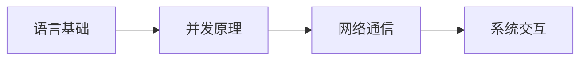

> 完整源码分析：[Go核心包解析目录](https://duoke360.com/tutorial/golang-src)

# 🗃️ MySQL 全栈开发实战指南

## 一、🚀 快速入门

### 1. 安装与配置

| 平台    | 安装方式  | 配置要点 | 教程链接                                                     |
| ------- | --------- | -------- | ------------------------------------------------------------ |
| Windows | MSI安装包 | 服务管理 | [Win安装](https://duoke360.com/tutorial/mysql/win-install-mysql) |
| Linux   | 源码编译  | 权限设置 | [Linux安装](https://duoke360.com/tutorial/mysql/linux-install-mysql) |
| macOS   | Homebrew  | 环境变量 | [macOS安装](https://duoke360.com/tutorial/mysql/macos-install-mysql) |

```bash
# 验证安装
mysql --version
# 配置文件位置
/etc/my.cnf  # [配置详解](https://duoke360.com/tutorial/mysql/mysql-conf)
```

## 二、📐 数据库设计

### 1. 规范化理论

| 范式级别 | 要求         | 示例         | 教程                                              |
| -------- | ------------ | ------------ | ------------------------------------------------- |
| 第一范式 | 原子性       | 拆分地址字段 | [三范式](https://duoke360.com/tutorial/mysql/3nf) |
| 第二范式 | 消除部分依赖 | 建立关系表   | 同上                                              |
| 第三范式 | 消除传递依赖 | 分离派生字段 | 同上                                              |

### 2. 数据类型选择

| 类型     | 存储空间 | 适用场景    | 注意事项      |
| -------- | -------- | ----------- | ------------- |
| INT      | 4字节    | 主键/计数器 | 范围限制      |
| VARCHAR  | 变长     | 文本字段    | 最大65535字节 |
| DATETIME | 8字节    | 时间记录    | 时区问题      |

```sql
-- 建表示例
CREATE TABLE users (
    id INT PRIMARY KEY AUTO_INCREMENT,
    name VARCHAR(50) NOT NULL,
    created_at DATETIME DEFAULT CURRENT_TIMESTAMP
);  -- [建表教程](https://duoke360.com/tutorial/mysql/create-table)
```

## 三、🔍 查询优化

### 1. 索引策略

| 索引类型 | 数据结构 | 适用场景 | 性能影响   |
| -------- | -------- | -------- | ---------- |
| B-Tree   | 平衡树   | 范围查询 | 增删稍慢   |
| Hash     | 哈希表   | 精确匹配 | 不支持排序 |
| FullText | 倒排索引 | 文本搜索 | 大文本专用 |

```sql
-- 执行计划分析
EXPLAIN SELECT * FROM users WHERE name LIKE '张%'; 
-- [Explain详解](https://duoke360.com/tutorial/mysql/index-explain)
```

### 2. 高级查询技巧

| 技术     | SQL示例                   | 应用场景 | 教程                                                       |
| -------- | ------------------------- | -------- | ---------------------------------------------------------- |
| 子查询   | `WHERE id IN (SELECT...)` | 嵌套过滤 | [子查询](https://duoke360.com/tutorial/mysql/sub-query)    |
| 连接查询 | `LEFT JOIN orders ON...`  | 关联数据 | [连接查询](https://duoke360.com/tutorial/mysql/inner-join) |
| 窗口函数 | `RANK() OVER()`           | 数据分析 | MySQL 8.0+                                                 |

## 四、⚙️ 高级特性

### 1. 事务管理

| 隔离级别         | 脏读 | 不可重复读 | 幻读 | 性能 |
| ---------------- | ---- | ---------- | ---- | ---- |
| READ UNCOMMITTED | ✓    | ✓          | ✓    | 最高 |
| REPEATABLE READ  | ×    | ×          | ✓    | 平衡 |

```sql
-- 事务示例
START TRANSACTION;
UPDATE accounts SET balance = balance - 100 WHERE user_id = 1;
UPDATE accounts SET balance = balance + 100 WHERE user_id = 2;
COMMIT;  -- [ACID特性](https://duoke360.com/tutorial/mysql/acid)
```

### 2. 存储程序

| 类型     | 执行方式 | 典型应用     | 教程                                                         |
| -------- | -------- | ------------ | ------------------------------------------------------------ |
| 存储过程 | CALL命令 | 复杂业务逻辑 | [语法](https://duoke360.com/tutorial/mysql/procedure-syntax) |
| 触发器   | 自动触发 | 审计日志     | [触发器](https://duoke360.com/tutorial/mysql/insert-trigger) |
| 视图     | 虚拟表   | 数据权限控制 | [视图](https://duoke360.com/tutorial/mysql/view)             |

## 五、🔒 安全管理

### 1. 权限控制矩阵

| 权限   | 作用域 | SQL命令                              |
| ------ | ------ | ------------------------------------ |
| SELECT | 表/列  | GRANT SELECT ON db.* TO user         |
| INSERT | 表     | GRANT INSERT ON db.table TO user     |
| ALL    | 数据库 | GRANT ALL PRIVILEGES ON *.* TO admin |

### 2. 日志监控

| 日志类型 | 记录内容 | 配置参数       | 分析工具        |
| -------- | -------- | -------------- | --------------- |
| 慢查询   | 执行耗时 | slow_query_log | pt-query-digest |
| 二进制   | 数据变更 | log_bin        | mysqlbinlog     |

## 六、🚀 高可用方案

### 1. 主从复制

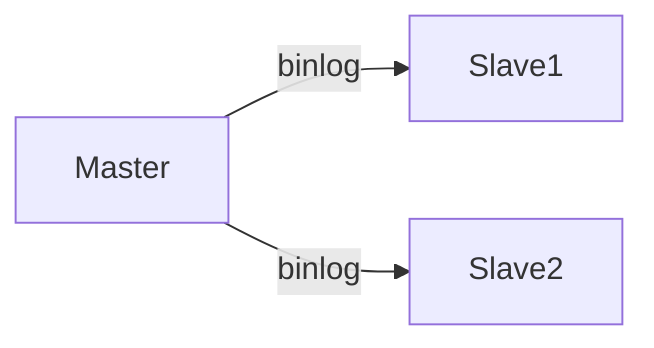

- [配置步骤](https://duoke360.com/tutorial/mysql/master-slave-replication)
- 读写分离策略

### 2. 集群方案对比

| 方案     | 数据一致性 | 自动故障转移 | 适用规模 |
| -------- | ---------- | ------------ | -------- |
| 主从复制 | 最终一致   | 手动切换     | 中小型   |
| MGR      | 强一致     | 自动选举     | 大型系统 |

## 📚 学习路径

1. **基础阶段**：安装 → SQL语法 → 索引
2. **进阶提升**：事务 → 存储过程 → 性能优化
3. **高可用**：主从复制 → 分库分表 → 集群管理

> 完整MySQL生态：[多课网MySQL专题](https://duoke360.com/tutorial/mysql)


以下是整理后的可点击文档目录，按照功能模块分类呈现：

### 🐝 Beego Web框架全功能指南

#### 一、入门基础

1. [Beego框架简介](https://duoke360.com/tutorial/beego/beego-intro)
2. [创建第一个Beego项目](https://duoke360.com/tutorial/beego/first-project)
3. [项目结构深度解析](https://duoke360.com/tutorial/beego/beego-project-structure)
4. [Bee工具使用指南](https://duoke360.com/tutorial/beego/bee-tools)

#### 二、核心配置

1. [参数配置详解](https://duoke360.com/tutorial/beego/beego-config)
2. [路由设置全攻略](https://duoke360.com/tutorial/beego/beego-router)
3. [控制器开发手册](https://duoke360.com/tutorial/beego/beego-controller)
4. [请求参数获取方法](https://duoke360.com/tutorial/beego/beego-request-param)

#### 三、数据操作

1. [Beego ORM入门](https://duoke360.com/tutorial/beego/beego-orm)
2. [高级查询技巧](https://duoke360.com/tutorial/beego/beego-adv-query)
3. [原生SQL执行方案](https://duoke360.com/tutorial/beego/beego-raw-sql)

#### 四、视图模板

1. [模板语法完全指南](https://duoke360.com/tutorial/beego/beego-template-syntax)
2. [模板处理最佳实践](https://duoke360.com/tutorial/beego/beego-template-handle)

---

### 学习路径建议

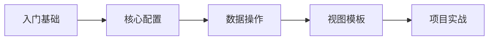

# 🌐 Go语言网络编程完全指南

## 一、📡 网络基础

### 核心概念

1. [网络编程简介](https://duoke360.com/tutorial/network/intro)
2. [TCP/IP协议详解](https://duoke360.com/tutorial/network/tcp-ip)
3. [HTTP协议全解析](https://duoke360.com/tutorial/network/http-protocol)
4. [DNS工作原理](https://duoke360.com/tutorial/network/dns)

### 协议对比

| 协议 | 特点       | 适用场景 | 详细对比                                                     |
| ---- | ---------- | -------- | ------------------------------------------------------------ |
| TCP  | 可靠连接   | 文件传输 | [TCP/UDP区别](https://duoke360.com/tutorial/network/tcp-vs-udp) |
| UDP  | 高效无连接 | 实时视频 | 同上                                                         |
| HTTP | 应用层协议 | Web开发  | [HTTP详解](https://duoke360.com/tutorial/network/http-protocol) |

## 二、🛠️ Socket编程

### 基础操作

1. [Socket编程入门](https://duoke360.com/tutorial/network/socket-basic)
2. [TCP服务器实现](https://duoke360.com/tutorial/network/tcp-coding)
3. [UDP通信实例](https://duoke360.com/tutorial/network/udp-coding)

```go
// TCP服务器示例
ln, err := net.Listen("tcp", ":8080")
if err != nil {
    log.Fatal(err)
}
for {
    conn, err := ln.Accept()
    go handleConnection(conn)
}
```

### 实战项目

1. [TCP聊天室](https://duoke360.com/tutorial/network/tcp-chat)
2. [UDP聊天室](https://duoke360.com/tutorial/network/udp-chat)

## 三、🌍 HTTP开发

### 核心知识

1. [HTTP请求格式](https://duoke360.com/tutorial/network/request-format)
2. [HTTP响应格式](https://duoke360.com/tutorial/network/response-format)
3. [RESTful设计](https://duoke360.com/tutorial/network/restful)

### Go实战

1. [HTTP客户端](https://duoke360.com/tutorial/network/http-coding)
2. [Header处理](https://duoke360.com/tutorial/network/golang-request-header)
3. [Cookie应用](https://duoke360.com/tutorial/network/golang-cookie)

## 四、🔌 高级协议

### WebSocket

1. [WebSocket编程](https://duoke360.com/tutorial/network/websocket)

```go
// WebSocket握手示例
upgrader := websocket.Upgrader{}
conn, err := upgrader.Upgrade(w, r, nil)
```

### RPC开发

1. [RPC基础](https://duoke360.com/tutorial/network/rpc)
2. [gRPC框架](https://duoke360.com/tutorial/network/rpc-framework)

## 五、🛡️ 安全实践

1. [HTTPS配置](https://duoke360.com/tutorial/network/https)
2. [CSRF防御](https://duoke360.com/tutorial/network/golang-cookie4)
3. [Session安全](https://duoke360.com/tutorial/network/golang-session1)

## 六、🏗️ 框架选型

| 框架类型 | 推荐方案 | 适用场景     | 教程                                                         |
| -------- | -------- | ------------ | ------------------------------------------------------------ |
| TCP框架  | gnet     | 高性能服务器 | [TCP框架](https://duoke360.com/tutorial/network/tcp-framework) |
| HTTP框架 | Gin      | Web开发      | [HTTP框架](https://duoke360.com/tutorial/network/http-framework) |
| 游戏框架 | Leaf     | 游戏服务器   | [游戏框架](https://duoke360.com/tutorial/network/game-framework) |

## 📚 学习路径

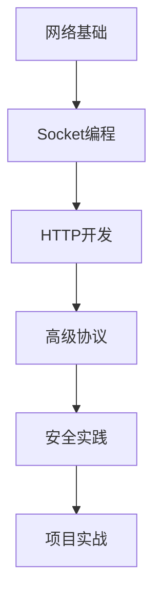

# 🚀 Gin Web 框架完全指南

## 一、🌐 基础入门

### 核心概念

1. [HTTP协议简介](https://duoke360.com/tutorial/gin/gin-http)
2. [RESTful风格编程](https://duoke360.com/tutorial/gin/restful)
3. [Gin框架简介](https://duoke360.com/tutorial/gin/gin-intro)

```go
// 最小Gin应用
package main

import "github.com/gin-gonic/gin"

func main() {
    r := gin.Default()
    r.GET("/", func(c *gin.Context) {
        c.String(200, "Hello Gin!")
    })
    r.Run() // 默认监听 :8080
}
```

## 二、🛠️ 核心功能

### 请求处理

| 功能     | 方法           | 示例              | 文档                                                         |
| -------- | -------------- | ----------------- | ------------------------------------------------------------ |
| 参数获取 | Query/PostForm | `c.Query("name")` | [请求参数](https://duoke360.com/tutorial/gin/gin-request-param) |
| 数据绑定 | ShouldBind     | 结构体绑定        | [数据绑定](https://duoke360.com/tutorial/gin/gin-data-binding) |
| 表单处理 | MultipartForm  | 文件上传          | [表单处理](https://duoke360.com/tutorial/gin/gin-handle-form) |

### 响应渲染

1. [输出渲染](https://duoke360.com/tutorial/gin/gin-render)

   - JSON/XML/HTML/YAML

2. [静态文件服务](https://duoke360.com/tutorial/gin/gin-bs)

   ```go
   r.Static("/assets", "./assets")
   ```

## 三、🔐 安全与认证

### 会话管理

1. [Cookie使用](https://duoke360.com/tutorial/gin/gin-cookie)

   ```go
   c.SetCookie("name", "value", 3600, "/", "localhost", false, true)
   ```

2. [Session集成](https://duoke360.com/tutorial/gin/gin-sesstion)

### 中间件

| 中间件    | 作用     | 集成方式  | 文档                                                         |
| --------- | -------- | --------- | ------------------------------------------------------------ |
| 日志      | 请求记录 | 默认启用  | [中间件](https://duoke360.com/tutorial/gin/gin-middleware)   |
| BasicAuth | 基础认证 | 手动配置  | [BasicAuth](https://duoke360.com/tutorial/gin/gin-basicauth) |
| 自定义    | 业务逻辑 | Use()注册 | 同上                                                         |

## 四、🏗️ 项目架构

### 路由组织

1. [路由分组](https://duoke360.com/tutorial/gin/gin-route-group)

   ```go
   v1 := r.Group("/v1")
   {
       v1.GET("/users", listUsers)
   }
   ```

2. [RESTful CRUD](https://duoke360.com/tutorial/gin/gin-restful)

### 文件处理

1. [文件上传](https://duoke360.com/tutorial/gin/gin-file-upload)

   ```go
   file, _ := c.FormFile("file")
   c.SaveUploadedFile(file, dst)
   ```

## 五、⚡ 性能优化

### 最佳实践

1. 使用`gin.SetMode(gin.ReleaseMode)`
2. 避免全局变量竞争
3. 连接池配置

## 📚 学习路径

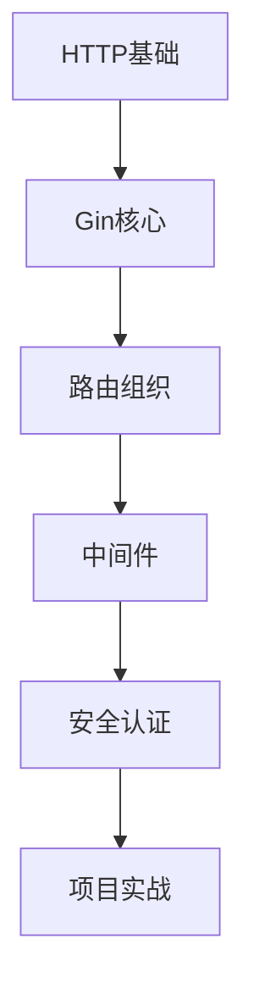

> 提示：点击各标题链接查看详细教程，推荐学习顺序：
>
> 1. 基础入门 → 2. 请求处理 → 3. 会话管理 → 4. 项目架构

### 完整案例

1. [用户登录系统](https://duoke360.com/tutorial/gin/gin-login)
2. [博客系统CRUD](https://duoke360.com/tutorial/gin/gin-restful)


# 🚀 Beego 博客项目实战指南

## 一、🎯 项目概述

### 核心功能模块

| 模块     | 技术实现            | 相关教程                                                     |
| -------- | ------------------- | ------------------------------------------------------------ |
| 用户系统 | Beego控制器+GORM    | [用户注册](https://duoke360.com/tutorial/beego-project/beego-pro-register) |
| 博客管理 | Markdown编辑器集成  | [博客发布](https://duoke360.com/tutorial/beego-project/beego-pro-add-blog) |
| 前端界面 | Bootstrap响应式布局 | [静态页面](https://duoke360.com/tutorial/beego-project/beego-pro-static-page) |

## 二、🛠️ 环境搭建

### 1. 初始化项目

```bash
bee new blogproject
cd blogproject
# [创建项目教程](https://duoke360.com/tutorial/beego-project/beego-pro-new)
```

### 2. 数据库集成

```go
import "gorm.io/gorm"

func init() {
    // [GORM集成](https://duoke360.com/tutorial/beego-project/beego-pro-gorm)
    db, err := gorm.Open(mysql.Open(dsn), &gorm.Config{})
    orm.RegisterModel(new(User), new(Post))
}
```

## 三、👥 用户模块

### 1. 功能清单

- 注册/登录/退出
- 会话管理
- 权限控制

### 2. 核心实现

```go
// [用户控制器](https://duoke360.com/tutorial/beego-project/beego-pro-adduser)
type UserController struct {
    beego.Controller
}

func (c *UserController) Login() {
    // [登录逻辑](https://duoke360.com/tutorial/beego-project/beego-pro-login)
    username := c.GetString("username")
    password := c.GetString("password")
}
```

## 四、📝 博客模块

### 1. 数据模型

```go
type Post struct {
    gorm.Model
    Title   string `gorm:"size:255"`
    Content string `gorm:"type:text"`
    UserID  uint
}
// [模型设计](https://duoke360.com/tutorial/beego-project/beego-pro-blog-add)
```

### 2. 功能实现

| 功能     | 技术要点     | 教程链接                                                     |
| -------- | ------------ | ------------------------------------------------------------ |
| 博客发布 | Markdown解析 | [添加博客](https://duoke360.com/tutorial/beego-project/beego-pro-add-blog) |
| 博客列表 | 分页查询     | [博客列表](https://duoke360.com/tutorial/beego-project/beego-pro-blog-list) |
| 详情页   | 路由参数     | [博客详情](https://duoke360.com/tutorial/beego-project/beego-pro-blog-detail) |

## 五、🎨 前端集成

### 1. UI框架

```html
<!-- [Bootstrap集成](https://duoke360.com/tutorial/beego-project/beego-pro-bs) -->
<link href="/static/css/bootstrap.min.css" rel="stylesheet">
```

### 2. Markdown编辑器

```javascript
// [编辑器集成](https://duoke360.com/tutorial/beego-project/beego-pro-md)
var editor = new Editor();
editor.render();
```

## 六、🔧 项目优化

### 1. 目录结构

```
blogproject/
├── controllers/
│   ├── user.go
│   └── post.go
├── models/
│   ├── user.go
│   └── post.go
├── static/
│   ├── css/
│   └── js/
└── views/
    ├── user/
    └── post/
```

### 2. 生产部署

```bash
bee pack -be GOOS=linux
# 配置Nginx反向代理
```

## 📚 完整学习路径

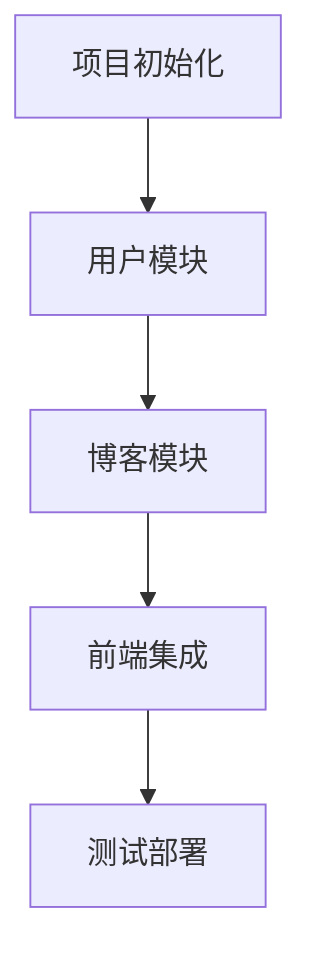

> 实战建议：按照以下顺序开发功能：
>
> 1. 用户注册 → 2. 登录退出 → 3. 博客CRUD → 4. 界面优化


# 🕷️ Go语言爬虫开发完全指南

## 一、🕸️ 爬虫基础

### 1. 核心概念

| 技术点   | 说明            | 教程链接                                                     |
| -------- | --------------- | ------------------------------------------------------------ |
| HTTP请求 | net/http库基础  | [第一个爬虫](https://duoke360.com/tutorial/spider/golang-spider-by-http) |
| 页面解析 | HTML内容提取    | [解析页面](https://duoke360.com/tutorial/spider/spider-parse-page) |
| 数据存储 | 文件/数据库存储 | [保存到数据库](https://duoke360.com/tutorial/spider/spider-save-to-db) |

```go
// 基础HTTP爬虫示例
resp, err := http.Get("http://example.com")
defer resp.Body.Close()
body, _ := io.ReadAll(resp.Body)
```

## 二、🧰 工具库详解

### 1. GoQuery深度解析

| 功能     | API方法         | 应用场景   | 文档                                                         |
| -------- | --------------- | ---------- | ------------------------------------------------------------ |
| 文档加载 | NewDocument     | 初始化解析 | [Document](https://duoke360.com/tutorial/spider/goquery-document) |
| 元素选择 | Find()/Filter() | 精准定位   | [选择器](https://duoke360.com/tutorial/spider/goquery-selector) |
| 内容提取 | Text()/Attr()   | 数据抓取   | [Selection](https://duoke360.com/tutorial/spider/goquery-selection) |

```go
doc, _ := goquery.NewDocumentFromReader(resp.Body)
doc.Find("h1").Each(func(i int, s *goquery.Selection) {
    fmt.Println(s.Text())
})
```

### 2. Colly框架实战

| 组件       | 功能     | 配置参数      | 教程                                                         |
| ---------- | -------- | ------------- | ------------------------------------------------------------ |
| Collector  | 爬虫主体 | 并发控制      | [配置指南](https://duoke360.com/tutorial/spider/colly-config) |
| Callbacks  | 事件处理 | 请求生命周期  | [回调方法](https://duoke360.com/tutorial/spider/colly-callback) |
| LimitRules | 访问控制 | 延迟/域名限制 | 框架配置                                                     |

```go
c := colly.NewCollector(
    colly.AllowedDomains("example.com"),
    colly.Async(true),
)
c.OnHTML("a[href]", func(e *colly.HTMLElement) {
    fmt.Println(e.Attr("href"))
})
```

## 三、⚡ 高级技巧

### 1. 反爬应对策略

| 反爬类型      | 解决方案         | 代码示例                           |
| ------------- | ---------------- | ---------------------------------- |
| UserAgent检测 | 随机UA轮换       | `collector.UserAgent = randomUA()` |
| IP封锁        | 代理IP池         | `collector.SetProxyFunc()`         |
| 验证码        | OCR识别/打码平台 | 第三方服务集成                     |

### 2. 性能优化方案

```go
// 并发控制
collector.Limit(&colly.LimitRule{
    DomainGlob:  "*",
    Parallelism: 5,
    Delay:       2 * time.Second,
})

// 内存优化
collector.OnScraped(func(r *colly.Response) {
    r.Body = nil // 及时释放内存
})
```

## 四、📦 数据存储方案

### 1. 多存储方式对比

| 存储类型      | 适用场景   | 实现库          | 教程                                                         |
| ------------- | ---------- | --------------- | ------------------------------------------------------------ |
| CSV文件       | 快速导出   | encoding/csv    | [本地文件存储](https://duoke360.com/tutorial/spider/spider-save-to-local) |
| MySQL         | 结构化数据 | XORM/GORM       | [数据库存储](https://duoke360.com/tutorial/spider/spider-save-to-db) |
| Elasticsearch | 全文检索   | olivere/elastic | 高级搜索场景                                                 |

## 五、🛠️ 项目实战路径

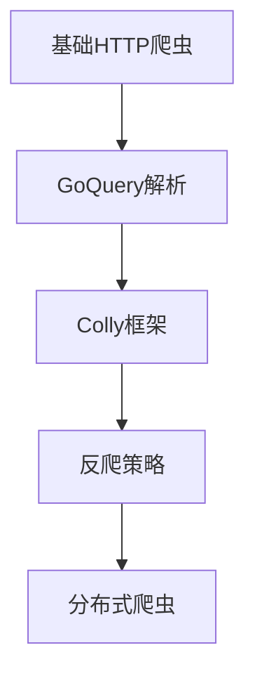

### 推荐学习顺序：

1. [基础爬虫实现](https://duoke360.com/tutorial/spider/golang-spider-by-http)
2. [GoQuery重构项目](https://duoke360.com/tutorial/spider/goquery-reapply)
3. [Colly框架迁移](https://duoke360.com/tutorial/spider/colly-app)

## 六、🚨 法律与伦理

1. 遵守robots.txt协议
2. 控制请求频率
3. 避免敏感数据抓取

> 完整项目示例可参考各教程链接，建议从简单页面开始逐步挑战复杂目标

### 性能对比数据

| 方案         | 请求QPS  | 内存占用 | 开发复杂度 |
| ------------ | -------- | -------- | ---------- |
| 原生net/http | 100-300  | 低       | 高         |
| Colly框架    | 500-1000 | 中       | 低         |
| 分布式集群   | 5000+    | 高       | 极高       |

# 🚀 Go语言专题精进指南

## 一、🔧 开发工具与技巧

### 1. 开发环境

| 工具    | 功能亮点      | 教程链接                                                     |
| ------- | ------------- | ------------------------------------------------------------ |
| VS Code | 代码补全/调试 | [VS Code配置](https://duoke360.com/tutorial/topic/vscode_golang) |
| GoLand  | 专业IDE支持   | [GoLand技巧](https://duoke360.com/tutorial/topic/goland-golang) |
| Air     | 热重载开发    | [热部署](https://duoke360.com/tutorial/topic/web-air)        |

```bash
# Air热重载配置示例
air -c .air.toml
```

### 2. 生产力工具

1. [代码模板生成](https://duoke360.com/tutorial/topic/goland-template)
2. [结构体tag生成](https://duoke360.com/tutorial/topic/go-struct-tag)
3. [AI辅助编程](https://duoke360.com/tutorial/topic/tabnine)

## 二、⚙️ 核心进阶技术

### 1. 语言特性

| 主题   | 关键知识点      | 深度解析                                                     |
| ------ | --------------- | ------------------------------------------------------------ |
| 泛型   | 类型参数/约束   | [1.18泛型](https://duoke360.com/tutorial/topic/generics)     |
| 工作区 | 多模块管理      | [Workspace](https://duoke360.com/tutorial/topic/go-workspace) |
| 接口   | 隐式实现/空接口 | [接口详解](https://duoke360.com/tutorial/topic/repeat-interface) |

```go
// 泛型示例
func PrintSlice[T any](s []T) {
    for _, v := range s {
        fmt.Println(v)
    }
}
```

### 2. 并发编程

1. [Context控制](https://duoke360.com/tutorial/topic/golang-context)
2. [限流策略](https://duoke360.com/tutorial/topic/golang-limit)
3. [Hystrix熔断](https://duoke360.com/tutorial/topic/hystrix-go)

## 三、🛡️ 安全与架构

### 1. 安全防护

| 技术   | 应用场景 | 实现方案                                                     |
| ------ | -------- | ------------------------------------------------------------ |
| JWT    | 接口鉴权 | [JWT实践](https://duoke360.com/tutorial/topic/golang-jwt)    |
| Casbin | RBAC权限 | [访问控制](https://duoke360.com/tutorial/topic/golang-casbin) |
| CSRF   | 表单安全 | [Gin中间件](https://duoke360.com/tutorial/topic/gin-csrf)    |

### 2. 分布式架构

1. [Redis集成](https://duoke360.com/tutorial/topic/golang-redis)
2. [gRPC+etcd](https://duoke360.com/tutorial/topic/golang-redis-grpc-etcd)
3. [WebSocket实时通信](https://duoke360.com/tutorial/topic/gin-websocket)

## 四、📊 数据处理

### 1. 数据操作

| 类型   | 处理库        | 教程链接                                                     |
| ------ | ------------- | ------------------------------------------------------------ |
| Excel  | Excelize      | [Excel操作](https://duoke360.com/tutorial/topic/golang-excel) |
| 验证码 | 图形生成      | [验证码](https://duoke360.com/tutorial/topic/golang-captcha) |
| 短信   | 阿里云/腾讯云 | [短信验证](https://duoke360.com/tutorial/topic/sms)          |

### 2. 数据存储

```go
// GORM分页实现
db.Scopes(Paginate(r)).Find(&users)
// [分页方案](https://duoke360.com/tutorial/topic/gin-gorm-page)
```

## 五、🚀 部署与运维

### 1. 容器化部署

| 平台       | 配置要点   | 教程                                                         |
| ---------- | ---------- | ------------------------------------------------------------ |
| Docker     | 多阶段构建 | [Docker部署](https://duoke360.com/tutorial/topic/go-project-docker) |
| Kubernetes | YAML配置   | [K8S部署](https://duoke360.com/tutorial/topic/k8s-deploy-golang-pro) |
| Nginx      | 反向代理   | [Gin+Nginx](https://duoke360.com/tutorial/topic/gin-nginx)   |

### 2. 监控与调优

1. [运行时监控](https://duoke360.com/tutorial/topic/statsviz)
2. [日志管理(logrus)](https://duoke360.com/tutorial/topic/logrus)
3. [性能分析pprof]

## 六、🎯 全栈方案

### 1. 前后端分离

[Gin+Gorm+Vue.js](https://duoke360.com/tutorial/topic/gin-gorm-vuejs)

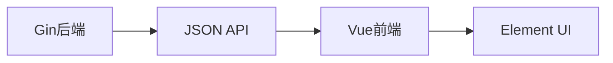

### 2. 实用工具库

| 库名称    | 功能     | 文档                                                         |
| --------- | -------- | ------------------------------------------------------------ |
| Cobra     | CLI开发  | [命令行框架](https://duoke360.com/tutorial/topic/golang-cobra) |
| Viper     | 配置管理 | [配置读取](https://duoke360.com/tutorial/topic/golang-viper) |
| Validator | 数据校验 | [验证规则](https://duoke360.com/tutorial/topic/golang-validator) |

# 🐧 Linux 系统管理完全指南

## 一、🚀 Linux 入门基础

### 1. 系统初识

| 主题      | 核心内容            | 详细教程                                                   |
| --------- | ------------------- | ---------------------------------------------------------- |
| Linux简介 | 发展历史/发行版本   | [Linux简介](https://duoke360.com/tutorial/linux/intro)     |
| 系统结构  | 内核/Shell/文件系统 | [系统结构](https://duoke360.com/tutorial/linux/sys-arch)   |
| 目录结构  | /bin /etc /home 等  | [目录结构](https://duoke360.com/tutorial/linux/dir-struct) |

```bash
# 获取帮助命令
man ls          # 查看手册
ls --help       # 快速帮助
# [帮助系统](https://duoke360.com/tutorial/linux/help)
```

### 2. 环境搭建

1. [VMware安装CentOS7](https://duoke360.com/tutorial/linux/install-vm)
2. [SSH远程连接](https://duoke360.com/tutorial/linux/ssh)
3. [虚拟机克隆技巧](https://duoke360.com/tutorial/linux/vm-clone)

## 二、📁 文件与目录管理

### 1. 基本操作命令

| 命令   | 功能     | 常用参数    | 教程                                                   |
| ------ | -------- | ----------- | ------------------------------------------------------ |
| ls     | 列出目录 | -l -a -h    | [ls命令](https://duoke360.com/tutorial/linux/ls)       |
| cd/pwd | 目录导航 | ~ - ..      | [目录切换](https://duoke360.com/tutorial/linux/cd-pwd) |
| mkdir  | 创建目录 | -p 递归创建 | [创建目录](https://duoke360.com/tutorial/linux/mkdir)  |

### 2. 文件操作进阶

```bash
# 文件操作组合示例
cp -r dir1 dir2   # [拷贝命令](https://duoke360.com/tutorial/linux/cp)
grep "error" log.txt | less  # [查看命令](https://duoke360.com/tutorial/linux/more-less)
```

## 三、👥 用户与权限

### 1. 用户管理

| 命令    | 功能     | 配置文件    | 教程                                                        |
| ------- | -------- | ----------- | ----------------------------------------------------------- |
| useradd | 添加用户 | /etc/passwd | [用户管理](https://duoke360.com/tutorial/linux/user-manage) |
| passwd  | 修改密码 | /etc/shadow | 同上                                                        |
| chmod   | 权限修改 | 755/644     | [权限管理](https://duoke360.com/tutorial/linux/chmod)       |

### 2. 权限体系

```bash
# 典型权限设置
chmod 755 script.sh  # rwxr-xr-x
chown user:group file  # [属主修改](https://duoke360.com/tutorial/linux/chown)
```

## 四、💾 磁盘与存储

### 1. 磁盘管理

| 命令  | 功能     | 应用场景   | 教程                                                  |
| ----- | -------- | ---------- | ----------------------------------------------------- |
| fdisk | 分区管理 | 新增磁盘   | [分区管理](https://duoke360.com/tutorial/linux/fdisk) |
| df    | 空间查看 | 监控磁盘   | [磁盘查询](https://duoke360.com/tutorial/linux/df-du) |
| mount | 挂载设备 | 持久化挂载 | 实战案例                                              |

### 2. 压缩解压

| 格式    | 压缩命令  | 解压命令  | 特点     |
| ------- | --------- | --------- | -------- |
| .zip    | zip       | unzip     | 跨平台   |
| .tar.gz | tar -zcvf | tar -zxvf | 高压缩比 |

## 五、📦 软件管理

### 包管理器对比

| 系统   | 工具     | 命令示例            | 教程                                           |
| ------ | -------- | ------------------- | ---------------------------------------------- |
| Debian | apt      | apt install nginx   | [apt](https://duoke360.com/tutorial/linux/apt) |
| RHEL   | yum      | yum install httpd   | [yum](https://duoke360.com/tutorial/linux/yum) |
| 通用   | 源码编译 | ./configure && make | 高级用法                                       |

## 六、🔧 高效工具

### 1. 编辑器之王

```bash
vim file.txt  # [Vim教程](https://duoke360.com/tutorial/linux/vim)
# 常用模式：i插入 ESC命令 :wq保存
```

### 2. 文件传输

```bash
# FTP上传下载
ftp 192.168.1.100  # [FTP操作](https://duoke360.com/tutorial/linux/ftp)
```

## 📚 学习路径建议

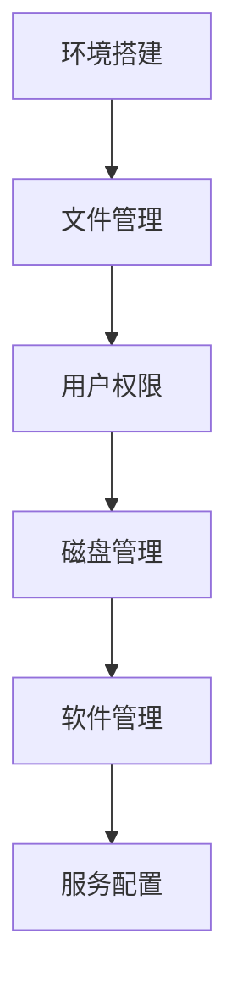

# 🐘 ZooKeeper 分布式协调服务完全指南

## 一、🔍 ZooKeeper 基础

### 1. 核心概念

| 主题     | 关键内容           | 详细教程                                                     |
| -------- | ------------------ | ------------------------------------------------------------ |
| 简介     | 分布式协调服务     | [ZooKeeper简介](https://duoke360.com/tutorial/zookeeper/zk-intro) |
| 数据模型 | ZNode树状结构      | [特点与数据模型](https://duoke360.com/tutorial/zookeeper/zk-feature) |
| 节点类型 | 持久/临时/顺序节点 | 同上                                                         |

```bash
# 数据模型示例
/
   ├── /service
   │    ├── /server1 [临时节点]
   │    └── /server2 [临时节点]
   └── /config [持久节点]
```

### 2. 环境搭建

1. [单机安装](https://duoke360.com/tutorial/zookeeper/zk-install)
2. [集群部署](https://duoke360.com/tutorial/zookeeper/cluster)
3. [配置详解](https://duoke360.com/tutorial/zookeeper/zookeeper-config)

## 二、🛠️ 运维管理

### 1. 常用命令

| 命令类型   | 示例                            | 功能     | 教程                                                         |
| ---------- | ------------------------------- | -------- | ------------------------------------------------------------ |
| 服务命令   | `zkServer.sh start`             | 启停服务 | [服务命令](https://duoke360.com/tutorial/zookeeper/zk-server-command) |
| 客户端命令 | `create /test data`             | 节点操作 | [客户端命令](https://duoke360.com/tutorial/zookeeper/zookeeper-client-command) |
| 四字命令   | `echo stat | nc 127.0.0.1 2181` | 监控状态 | [四字命令](https://duoke360.com/tutorial/zookeeper/zk-4lw)   |

### 2. 可视化工具

1. [ZooInspector](https://duoke360.com/tutorial/zookeeper/zk-zooInspector)
2. [ZKUI管理界面](https://duoke360.com/tutorial/zookeeper/zk-zkui)
3. [JMX监控](https://duoke360.com/tutorial/zookeeper/zookeeper-jmx)

## 三、💻 开发实战

### 1. 多语言客户端

| 语言   | 推荐库       | 教程链接                                                     |
| ------ | ------------ | ------------------------------------------------------------ |
| Java   | Curator      | [Curator教程](https://duoke360.com/tutorial/zookeeper/zk-java-curator) |
| Golang | go-zookeeper | [Go客户端](https://duoke360.com/tutorial/zookeeper/zk-golang) |
| Python | kazoo        | [Python操作](https://duoke360.com/tutorial/zookeeper/zk-python) |

```go
// Go连接示例
conn, _, err := zk.Connect([]string{"127.0.0.1"}, time.Second)
if err != nil {
    log.Fatal(err)
}
defer conn.Close()
```

### 2. 典型应用场景

| 场景     | 实现方案     | 关键API                     |
| -------- | ------------ | --------------------------- |
| 配置中心 | Watch机制    | GetData + Watcher           |
| 分布式锁 | 临时顺序节点 | Create EPHEMERAL_SEQUENTIAL |
| 服务发现 | 临时节点     | Create EPHEMERAL            |

## 四、⚙️ 核心机制

### 1. 选举流程

[ZAB协议详解](https://duoke360.com/tutorial/zookeeper/zk-election)

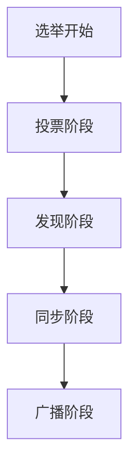

### 2. 一致性保证

- 顺序一致性
- 原子性广播
- 最终一致性

## 五、🚀 生产实践

### 1. 性能调优

| 参数      | 推荐值 | 说明           |
| --------- | ------ | -------------- |
| tickTime  | 2000   | 心跳间隔(ms)   |
| initLimit | 10     | 初始化连接超时 |
| syncLimit | 5      | 心跳超时阈值   |

### 2. 监控指标

```bash
# 关键监控命令
echo mntr | nc localhost 2181
# 输出包含zk_version, zk_avg_latency等
```

# 🐇 RabbitMQ 消息中间件完全指南

## 一、🔍 RabbitMQ 基础

### 1. 核心概念

| 概念     | 说明                             | 详细教程                                                     |
| -------- | -------------------------------- | ------------------------------------------------------------ |
| 消息队列 | 异步通信机制                     | [RabbitMQ简介](https://duoke360.com/tutorial/rabbitmq/rabbitmq-intro) |
| 核心组件 | Producer/Exchange/Queue/Consumer | [基本概念](https://duoke360.com/tutorial/rabbitmq/mq-basic)  |
| AMQP协议 | 高级消息队列协议                 | 同上                                                         |

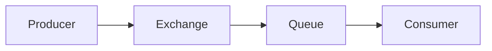

### 2. 环境搭建

- [Windows安装指南](https://duoke360.com/tutorial/rabbitmq/rabbitmq-install-on-windows)

- Linux/Mac安装建议：

  ```bash
  # Ubuntu示例
  sudo apt-get install rabbitmq-server
  sudo systemctl start rabbitmq-server
  ```

## 二、📨 消息模式详解

### 1. 基础模式

| 模式     | 特点           | 应用场景   | 教程                                                         |
| -------- | -------------- | ---------- | ------------------------------------------------------------ |
| 简单模式 | 一对一直接消费 | 单任务处理 | [简单模式](https://duoke360.com/tutorial/rabbitmq/mq-simple-pattern) |
| 工作队列 | 竞争消费       | 任务分发   | [工作队列](https://duoke360.com/tutorial/rabbitmq/mq-work-queue) |

```go
// 简单模式生产者示例
ch.Publish(
  "",     // exchange
  q.Name, // routing key
  false,  // mandatory
  false,  // immediate
  amqp.Publishing{
    ContentType: "text/plain",
    Body:        []byte(body),
})
```

### 2. 高级模式

| 模式     | 路由机制     | 图解                                                         | 教程                                                         |
| -------- | ------------ | ------------------------------------------------------------ | ------------------------------------------------------------ |
| 发布订阅 | Fanout交换器 |  | [发布订阅](https://duoke360.com/tutorial/rabbitmq/mq-pub-sub) |
| 路由模式 | Direct交换器 | 精准路由                                                     | [路由模式](https://duoke360.com/tutorial/rabbitmq/mq-route)  |
| 主题模式 | Topic交换器  | 模式匹配                                                     | [主题模式](https://duoke360.com/tutorial/rabbitmq/mq-topic)  |

## 三、⚙️ 高级特性

### 1. 可靠投递

| 机制       | 保证级别       | 配置方式           | 教程                                                         |
| ---------- | -------------- | ------------------ | ------------------------------------------------------------ |
| 生产者确认 | 消息到达Broker | `confirm.Select()` | [发布确认](https://duoke360.com/tutorial/rabbitmq/mq-publisher-confirm) |
| 事务机制   | 原子性操作     | `Tx()`系列方法     | 不推荐高性能场景                                             |
| 持久化     | 消息落盘       | `durable=true`     | 基础概念已涵盖                                               |

### 2. RPC调用

[远程过程调用实现](https://duoke360.com/tutorial/rabbitmq/mq-rpc)

```go
// RPC客户端流程
1. 创建回调队列
2. 发送请求消息(correlationId+replyTo)
3. 监听回调队列
```

## 四、🛠️ 运维管理

### 1. 常用命令

| 命令                         | 功能       | 示例            |
| ---------------------------- | ---------- | --------------- |
| `rabbitmqctl list_queues`    | 查看队列   | `name messages` |
| `rabbitmqctl list_exchanges` | 查看交换器 | `name type`     |
| `rabbitmq-plugins enable`    | 启用插件   | `management`    |

### 2. 管理界面

```bash
# 启用管理插件
rabbitmq-plugins enable rabbitmq_management
# 访问 http://localhost:15672
```

## 五、🚀 生产实践

### 1. 性能调优

| 参数        | 推荐值 | 说明         |
| ----------- | ------ | ------------ |
| prefetch    | 30-100 | 消费者预取值 |
| heartbeat   | 60     | 心跳超时(秒) |
| channel_max | 2047   | 最大通道数   |

### 2. 集群部署

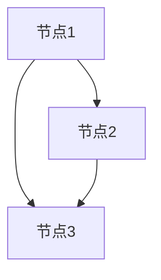

## 📚 学习路径

1. **基础阶段**：安装 → 简单模式 → 工作队列
2. **进阶阶段**：发布订阅 → 路由/主题 → RPC
3. **生产实战**：可靠性保证 → 性能调优 → 集群

> 所有蓝链均可直接点击查看详细教程，建议配合文档实践

### 常见问题

| 问题     | 排查方法                           |
| -------- | ---------------------------------- |
| 消息堆积 | `rabbitmqctl list_queues messages` |
| 连接泄漏 | `rabbitmqctl list_connections`     |
| 性能瓶颈 | 监控`deliver/get rates`            |

掌握RabbitMQ可以帮助构建高可靠的分布式系统，建议从简单模式开始逐步深入复杂场景！


# 🚀 Kafka 分布式消息系统完全指南

## 一、🔍 Kafka 核心概念

### 1. 基础架构

| 组件           | 作用         | 详细解析                                                     |
| -------------- | ------------ | ------------------------------------------------------------ |
| Broker         | 消息存储节点 | [Kafka架构](https://duoke360.com/tutorial/kafka/kafka-arch)  |
| Topic          | 消息类别     | [分区与偏移量](https://duoke360.com/tutorial/kafka/kafka-partition-offset) |
| Consumer Group | 消费者组     | [消费者组机制](https://duoke360.com/tutorial/kafka/kafka-consumer-group) |

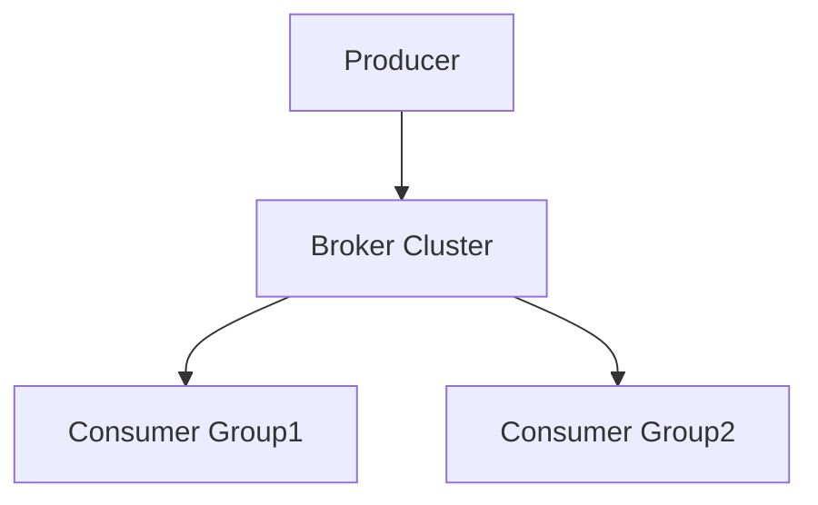

### 2. 消息中间件对比

| 特性                                                        | Kafka       | RabbitMQ | RocketMQ |
| ----------------------------------------------------------- | ----------- | -------- | -------- |
| 吞吐量                                                      | 超高        | 高       | 高       |
| 延迟                                                        | 低          | 极低     | 低       |
| 适用场景                                                    | 日志/流处理 | 事务消息 | 金融场景 |
| [完整对比](https://duoke360.com/tutorial/kafka/kafka-mq-vs) |             |          |          |

## 二、🛠️ 环境搭建与管理

### 1. 集群部署

- [单机安装指南](https://duoke360.com/tutorial/kafka/kafka-install)
- [集群配置教程](https://duoke360.com/tutorial/kafka/kafka-cluster)

```bash
# 启动Zookeeper（Kafka依赖）
bin/zookeeper-server-start.sh config/zookeeper.properties

# 启动Kafka节点
bin/kafka-server-start.sh config/server.properties
```

### 2. 可视化工具

| 工具            | 功能特点  | 教程链接                                                     |
| --------------- | --------- | ------------------------------------------------------------ |
| Kafka Manager   | 集群监控  | [使用指南](https://duoke360.com/tutorial/kafka/kafka-manager) |
| Offset Explorer | Topic管理 | [工具详解](https://duoke360.com/tutorial/kafka/kafka-tool)   |
| Kafka Eagle     | 监控告警  | [配置教程](https://duoke360.com/tutorial/kafka/kafka-eagle)  |

## 三、💻 开发实战

### 1. Java客户端

| 组件   | 核心API         | 教程链接                                                     |
| ------ | --------------- | ------------------------------------------------------------ |
| 生产者 | `KafkaProducer` | [Java生产者](https://duoke360.com/tutorial/kafka/kafka-client-java-producer) |
| 消费者 | `KafkaConsumer` | [Java消费者](https://duoke360.com/tutorial/kafka/kafka-client-java-consumer) |

```java
// 生产者示例片段
Properties props = new Properties();
props.put("bootstrap.servers", "localhost:9092");
props.put("key.serializer", "org.apache.kafka.common.serialization.StringSerializer");
props.put("value.serializer", "org.apache.kafka.common.serialization.StringSerializer");

Producer<String, String> producer = new KafkaProducer<>(props);
producer.send(new ProducerRecord<>("my-topic", "key", "value"));
```

### 2. Go客户端

| 功能   | 推荐库 | 教程链接                                                     |
| ------ | ------ | ------------------------------------------------------------ |
| 生产者 | sarama | [Go生产者](https://duoke360.com/tutorial/kafka/kafka-client-golang-producer) |
| 消费者 | sarama | [Go消费者](https://duoke360.com/tutorial/kafka/kafka-client-golang-consumer) |

```go
// Go消费者示例
config := sarama.NewConfig()
consumer, err := sarama.NewConsumer([]string{"localhost:9092"}, config)
partitionConsumer, err := consumer.ConsumePartition("my-topic", 0, sarama.OffsetNewest)
```

### 3. Python客户端

- [Python生产者](https://duoke360.com/tutorial/kafka/kafka-client-python-producer)
- [Python消费者](https://duoke360.com/tutorial/kafka/kafka-client-python-consumer)

## 四、⚙️ 高级特性

### 1. 消息保障机制

| 机制 | 配置参数                  | 可靠性   |
| ---- | ------------------------- | -------- |
| ACKS | `acks=all`                | 最高     |
| 重试 | `retries=3`               | 中等     |
| 幂等 | `enable.idempotence=true` | 精确一次 |

### 2. 性能优化

| 参数   | 生产者建议           | 消费者建议                      |
| ------ | -------------------- | ------------------------------- |
| 批处理 | `linger.ms=20`       | `fetch.min.bytes=1`             |
| 缓冲区 | `buffer.memory=32MB` | `fetch.max.wait.ms=500`         |
| 并发   | `max.in.flight=5`    | `max.partition.fetch.bytes=1MB` |

## 五、📊 运维监控

### 1. 常用命令

```bash
# Topic管理
bin/kafka-topics.sh --create --topic test --partitions 3 --replication-factor 2

# 消息消费测试
bin/kafka-console-consumer.sh --topic test --from-beginning --bootstrap-server localhost:9092
```

[完整命令指南](https://duoke360.com/tutorial/kafka/kafka-topic-cmd)

### 2. 关键指标监控

| 指标     | 健康值 | 监控命令                    |
| -------- | ------ | --------------------------- |
| 堆积量   | <1000  | `kafka-consumer-groups.sh`  |
| 网络IO   | <70%   | `kafka-server-start.sh`日志 |
| 磁盘使用 | <80%   | `df -h`                     |

## 📚 学习路径建议

1. **基础阶段**：单机部署 → Topic管理 → 命令行生产消费
2. **开发阶段**：Java客户端 → Go客户端 → Python客户端
3. **生产实战**：集群部署 → 性能调优 → 监控告警

> 所有蓝链均可直接点击查看详细教程，建议配合文档实践

### 常见问题排查

| 问题现象 | 可能原因     | 解决方案       |
| -------- | ------------ | -------------- |
| 消息丢失 | ACKS配置不当 | 设置`acks=all` |
| 消费延迟 | 分区不均衡   | 调整分区数     |
| 连接失败 | 防火墙限制   | 检查9092端口   |

掌握Kafka是构建实时数据管道的关键技能，建议从单节点开发环境开始逐步深入分布式集群管理！

当然可以，以下是按照你提供的样式整理的 **Prometheus 监控系统完全指南**：

------

# 🧭 Prometheus 监控系统完全指南

## 一、🔍 Prometheus 核心概念

### 1. 基础架构

| 组件              | 作用                   | 详细解析                                                     |
| ----------------- | ---------------------- | ------------------------------------------------------------ |
| Prometheus Server | 核心数据采集与存储引擎 | [Prometheus简介](https://duoke360.com/tutorial/prometheus/prometheus_intro) |
| Exporter          | 指标暴露端             | [使用Node Exporter监控主机](https://duoke360.com/tutorial/prometheus/prometheus-node-exporter) |
| AlertManager      | 告警管理器             | [安装与配置](https://duoke360.com/tutorial/prometheus/alertmanager) |

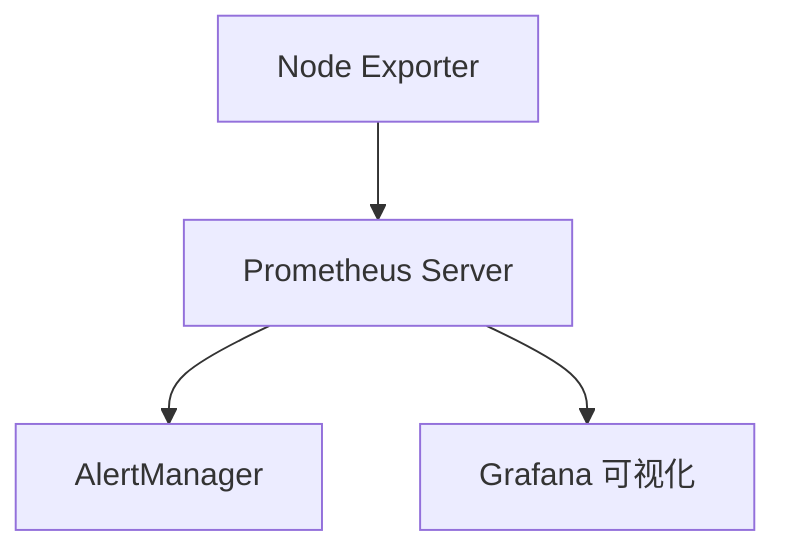

### 2. Prometheus 与其他系统对比

| 特性       | Prometheus   | Zabbix | ELK              |
| ---------- | ------------ | ------ | ---------------- |
| 部署复杂度 | 简单         | 中等   | 高               |
| 数据模型   | 时序数据     | 混合   | 文本索引         |
| 可视化能力 | Grafana      | 内建   | Kibana           |
| 告警支持   | AlertManager | 内建   | Logstash/Watcher |

## 二、🛠️ 安装与配置

### 1. 系统部署

- [Prometheus安装教程](https://duoke360.com/tutorial/prometheus/install)
- [设置为系统服务](https://duoke360.com/tutorial/prometheus/system-service)

```bash
# 解压并启动 Prometheus
tar -zxvf prometheus*.tar.gz
cd prometheus
./prometheus --config.file=prometheus.yml
```

### 2. 配置文件结构

| 配置项         | 说明                 | 教程链接                                                     |
| -------------- | -------------------- | ------------------------------------------------------------ |
| global         | 全局设置，如抓取频率 | [配置详解](https://duoke360.com/tutorial/prometheus/prometheus-config) |
| scrape_configs | 定义抓取目标         | 同上                                                         |
| alerting       | 配置告警推送         | 同上                                                         |

## 三、📦 Exporter与采集

### 1. Node Exporter 安装与配置

| 内容                         | 教程链接                                                     |
| ---------------------------- | ------------------------------------------------------------ |
| 安装 Node Exporter           | [安装与使用](https://duoke360.com/tutorial/prometheus/prometheus-node-exporter) |
| 配置 Prometheus 抓取主机指标 | 同上                                                         |

```yaml
# 示例 scrape_configs
scrape_configs:
  - job_name: 'node'
    static_configs:
      - targets: ['localhost:9100']
```

## 四、🚨 告警系统

### 1. AlertManager 配置与使用

| 功能              | 教程链接                                                     |
| ----------------- | ------------------------------------------------------------ |
| 安装 AlertManager | [安装教程](https://duoke360.com/tutorial/prometheus/alertmanager) |
| 基础配置          | [alertmanager配置](https://duoke360.com/tutorial/prometheus/alertmanager-config) |
| 实现告警推送      | [告警使用指南](https://duoke360.com/tutorial/prometheus/alertmanager-alert) |
| 自定义告警模板    | [模板配置](https://duoke360.com/tutorial/prometheus/prometheus-template) |

### 2. 告警规则配置示例

```yaml
groups:
- name: instance_down
  rules:
  - alert: InstanceDown
    expr: up == 0
    for: 1m
    labels:
      severity: critical
    annotations:
      summary: "实例 {{ $labels.instance }} 宕机"
```

## 五、📊 可视化集成

### 1. 使用 Grafana 展示 Prometheus 数据

| 步骤                   | 教程链接                                                     |
| ---------------------- | ------------------------------------------------------------ |
| 安装 Grafana           | [安装Grafana](https://duoke360.com/tutorial/prometheus/install-grafana) |
| 添加 Prometheus 数据源 | 同上                                                         |
| 导入仪表盘模板         | 同上                                                         |

## 📚 学习路径建议

1. **基础阶段**：安装Prometheus → 配置抓取 → Node Exporter部署
2. **进阶阶段**：配置AlertManager → 设置告警规则与模板
3. **实战阶段**：接入Grafana → 构建仪表盘 → 多实例监控部署

> 所有蓝色链接均可直接点击跳转，建议配合实机部署练习！

### 常见问题排查

| 问题现象     | 可能原因           | 解决方案           |
| ------------ | ------------------ | ------------------ |
| 没有抓取数据 | target配置错误     | 检查prometheus.yml |
| 告警无效     | AlertManager未连接 | 检查`alerting`配置 |
| 页面打不开   | 端口占用           | 更换默认端口或释放 |

掌握 Prometheus 是现代监控体系的基础，建议结合真实业务场景进行实战配置与优化！

以下是根据你提供内容，按 **Kafka 分布式消息系统完全指南** 样式整理的 **🚀 Docker 基础教程完全指南**：

------

# 🚀 Docker 基础教程完全指南

## 一、🔍 Docker 核心概念

### 1. Docker简介

| 内容             | 说明                       | 教程链接                                                     |
| ---------------- | -------------------------- | ------------------------------------------------------------ |
| 为什么使用Docker | 快速部署、轻量化、隔离性强 | [为什么使用Docker](https://duoke360.com/tutorial/docker/why-docker) |
| Docker核心概念   | 镜像、容器、仓库、网络等   | [Docker简介](https://duoke360.com/tutorial/docker/docker-intro) |

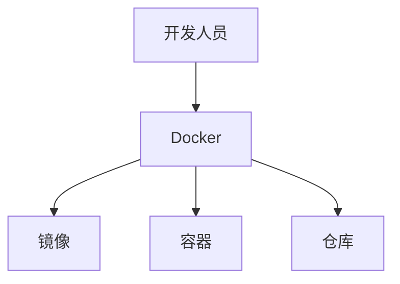

## 二、🛠️ 安装与基本操作

### 1. 安装与仓库管理

| 操作           | 描述               | 教程链接                                                     |
| -------------- | ------------------ | ------------------------------------------------------------ |
| 安装Docker     | 支持多系统安装教程 | [安装Docker](https://duoke360.com/tutorial/docker/install)   |
| Docker中央仓库 | Docker Hub使用说明 | [Docker的中央仓库](https://duoke360.com/tutorial/docker/docker-center-repo) |

### 2. 镜像与容器操作

| 操作     | 描述             | 教程链接                                                     |
| -------- | ---------------- | ------------------------------------------------------------ |
| 镜像操作 | 拉取、构建、管理 | [Docker镜像操作](https://duoke360.com/tutorial/docker/docker-image-operate) |
| 容器操作 | 启动、停止、删除 | [Docker容器操作](https://duoke360.com/tutorial/docker/docker-container) |

```bash
# 拉取镜像
docker pull nginx

# 运行容器
docker run -d -p 8080:80 nginx

# 查看容器
docker ps -a
```

## 三、💻 应用部署实战

### 1. Web项目部署

| 步骤           | 描述                        | 教程链接                                                     |
| -------------- | --------------------------- | ------------------------------------------------------------ |
| 准备项目       | 基于SpringBoot或前端Web项目 | [准备一个web项目](https://duoke360.com/tutorial/docker/prepare-web-project) |
| 创建MySQL容器  | 数据库服务容器化            | [创建MySQL容器](https://duoke360.com/tutorial/docker/mysql-container) |
| 创建Tomcat容器 | 应用服务容器化              | [创建Tomcat容器](https://duoke360.com/tutorial/docker/tomcat-container) |
| 部署到Tomcat   | 应用自动部署                | [将项目部署到Tomcat](https://duoke360.com/tutorial/docker/deploy-tomcat) |
| 使用数据卷     | 持久化与宿主机挂载          | [Docker数据卷](https://duoke360.com/tutorial/docker/docker-data-volume) |

## 四、⚙️ 自定义镜像与Compose

### 1. 自定义镜像

| 操作           | 描述             | 教程链接                                                     |
| -------------- | ---------------- | ------------------------------------------------------------ |
| Dockerfile语法 | 构建镜像脚本     | [Dockerfile](https://duoke360.com/tutorial/docker/dockerfile) |
| 构建自定义镜像 | 实现定制环境封装 | [Docker自定义镜像](https://duoke360.com/tutorial/docker/custom-image) |

```Dockerfile
# 简单示例
FROM tomcat:9.0
COPY ./myapp.war /usr/local/tomcat/webapps/
```

### 2. Docker Compose

| 操作           | 描述                      | 教程链接                                                     |
| -------------- | ------------------------- | ------------------------------------------------------------ |
| 安装Compose    | 管理多容器项目            | [下载安装Docker-Compose](https://duoke360.com/tutorial/docker/docker-compose) |
| 管理容器组     | MySQL+Tomcat联合启动      | [Docker-Compose管理MySQL和Tomcat容器](https://duoke360.com/tutorial/docker/docker-compose-mysql-tomcat) |
| 常用命令       | `up` / `down` / `logs` 等 | [使用docker-compose命令管理容器](https://duoke360.com/tutorial/docker/docker-compose-command) |
| 结合Dockerfile | 多服务构建统一镜像        | [docker-compose结合Dockerfile使用](https://duoke360.com/tutorial/docker/docker-compose-and-dockerfile) |

```yaml
# docker-compose.yml 示例
version: "3"
services:
  db:
    image: mysql:5.7
    environment:
      MYSQL_ROOT_PASSWORD: root
  web:
    build: .
    ports:
      - "8080:8080"
    depends_on:
      - db
```

## 📚 学习路径建议

1. **入门阶段**：了解核心概念 → 安装Docker → 镜像/容器操作
2. **实战阶段**：部署Web项目 → 使用数据卷 → 多容器编排
3. **进阶阶段**：自定义镜像 → 使用Compose提升效率 → 结合CI/CD

> 所有蓝链均可直接点击查看详细教程，建议搭配示例代码与实际部署环境演练

------

# 📦 Protocol Buffers 教程完全指南（Go语言版）

## 一、🔍 基础入门

| 教程内容                               | 简要说明                                     | 链接                                                         |
| -------------------------------------- | -------------------------------------------- | ------------------------------------------------------------ |
| Protocol Buffers 简介                  | 什么是 Protobuf？它解决了什么问题？          | [Protocol Buffers简介](https://duoke360.com/tutorial/pb/pb-intro) |
| 安装 Protocol Buffers 编译器           | 下载 protoc 编译器和 Go 插件的安装方式       | [下载安装Protocol Buffers编译器](https://duoke360.com/tutorial/pb/pb-install) |
| 编写第一个 `.proto` 文件并生成 Go 代码 | 从 0 到 1 实现你的第一个 Protobuf 文件并编译 | [编写第一个protobuf文件，并编译成go文件](https://duoke360.com/tutorial/pb/first_protobuf) |

```bash
# 编译 .proto 为 Go 代码示例
protoc --go_out=. --go-grpc_out=. helloworld.proto
```

## 二、📐 数据结构定义

| 教程内容     | 简要说明                                            | 链接                                                         |
| ------------ | --------------------------------------------------- | ------------------------------------------------------------ |
| 定义消息类型 | 使用 `message` 创建结构体类消息类型                 | [Protocol Buffers定义消息类型](https://duoke360.com/tutorial/pb/pb-message-type) |
| 基本数据类型 | int32、string、bool 等支持的类型和语义              | [Protocol Buffers基本数据类型](https://duoke360.com/tutorial/pb/pb-scalar-type) |
| 枚举类型     | 使用 `enum` 定义常量集（类似 Go 的 `const` + iota） | [Protocol Buffers枚举类型](https://duoke360.com/tutorial/pb/pb-enum) |

```proto
message User {
  int32 id = 1;
  string name = 2;
  Gender gender = 3;
}

enum Gender {
  MALE = 0;
  FEMALE = 1;
}
```

## 三、🧠 编译与源码分析

| 教程内容                    | 简要说明                                     | 链接                                                         |
| --------------------------- | -------------------------------------------- | ------------------------------------------------------------ |
| Protobuf 编译后源码结构解析 | 解读生成的 `.pb.go` 文件结构、接口和底层实现 | [Protobuf生成的go源码分析](https://duoke360.com/tutorial/pb/pb-src) |

```go
// 生成的结构体
type User struct {
  Id     int32
  Name   string
  Gender Gender
}
```

## 四、📤 数据序列化与通信

| 教程内容         | 简要说明                                       | 链接                                                         |
| ---------------- | ---------------------------------------------- | ------------------------------------------------------------ |
| 序列化和反序列化 | 使用 `proto.Marshal` 和 `proto.Unmarshal` 实现 | [Protobuf序列化和反序列化](https://duoke360.com/tutorial/pb/pb-ser) |
| 与 JSON 的互转   | `protojson` 模块支持 Protobuf <-> JSON 转换    | [protobuf和json相互转换](https://duoke360.com/tutorial/pb/pb-vs-json) |

```go
// 序列化
data, _ := proto.Marshal(&User{Id: 1, Name: "Tom"})
// 反序列化
var u User
_ = proto.Unmarshal(data, &u)
```

## 五、📡 服务定义与 gRPC 扩展

| 教程内容               | 简要说明                                         | 链接                                                         |
| ---------------------- | ------------------------------------------------ | ------------------------------------------------------------ |
| 在 `.proto` 中定义服务 | 使用 `service` + `rpc` 定义接口方法（gRPC 使用） | [在protobuf中定义服务](https://duoke360.com/tutorial/pb/pb-service) |

```proto
service UserService {
  rpc GetUser (UserRequest) returns (UserResponse);
}
```

------

## 📚 学习建议路径

1. **新手阶段**
    ▶ 理解 protobuf 的用途与基本语法 → 编写消息类型 → 编译生成代码
2. **进阶阶段**
    ▶ 使用序列化/反序列化 → 与 JSON 互转 → 服务定义配合 gRPC 使用
3. **实战阶段**
    ▶ 搭配 gRPC 构建 RPC 服务、与 REST API 比较、结合 micro 实现微服务框架

------

# 🚀 gRPC 远程过程调用（Go语言）完整教程

## 一、🔍 RPC 基础知识

| 教程内容                          | 简要说明                         | 链接                                                         |
| --------------------------------- | -------------------------------- | ------------------------------------------------------------ |
| RPC 简介                          | 远程过程调用概念及其发展历史     | [rpc简介](https://duoke360.com/tutorial/grpc/rpc-intro)      |
| 使用 `net/rpc` 实现 RPC（方式一） | Go 标准库自带的传统 RPC 实现方式 | [golang实现rpc方法一net/rpc库](https://duoke360.com/tutorial/grpc/rpc-method1) |
| 使用 `jsonrpc` 实现 RPC（方式二） | 基于 JSON 的 RPC 通信实现方式    | [golang实现rpc方法二jsonrpc库](https://duoke360.com/tutorial/grpc/jsonrpc) |

------

## 二、⚙️ gRPC 与 Protobuf 集成

| 教程内容                        | 简要说明                                   | 链接                                                         |
| ------------------------------- | ------------------------------------------ | ------------------------------------------------------------ |
| gRPC 与 Protocol Buffers 的结合 | 使用 `.proto` 定义接口并生成 gRPC 服务代码 | [grpc和protobuf在一起](https://duoke360.com/tutorial/grpc/grpc-and-protobuf) |
| 第一个 gRPC 应用                | 从定义到运行你的第一个 gRPC 服务           | [第一个grpc应用](https://duoke360.com/tutorial/grpc/first-grpc) |
| gRPC 服务定义和服务类型分类     | 一元请求、服务端流、客户端流、双向流简介   | [grpc服务的定义和服务的种类](https://duoke360.com/tutorial/grpc/service-define) |

```proto
service Greeter {
  rpc SayHello (HelloRequest) returns (HelloReply);
}
```

------

## 三、🔁 gRPC 流式通信实战

| 教程内容                          | 简要说明                                   | 链接                                                         |
| --------------------------------- | ------------------------------------------ | ------------------------------------------------------------ |
| 服务端单向流（Server Streaming）  | 客户端发起一次请求，服务端连续返回流式响应 | [grpc stream实例1-服务端单向流](https://duoke360.com/tutorial/grpc/grpc-stream1) |
| 客户端单向流（Client Streaming）  | 客户端连续发送请求，服务端统一响应一次     | [grpc stream实例2-客户端单向流](https://duoke360.com/tutorial/grpc/grpc-stream2) |
| 双向流（Bidirectional Streaming） | 客户端和服务端同时进行流式通信             | [grpc stream实例3-双向流](https://duoke360.com/tutorial/grpc/grpc-stream3) |

```go
// 双向流示意
stream, _ := client.Chat(context.Background())
stream.Send(&Message{...})
msg, _ := stream.Recv()
```

------

## 四、🌐 gRPC 与 Web 框架整合

| 教程内容           | 简要说明                            | 链接                                                       |
| ------------------ | ----------------------------------- | ---------------------------------------------------------- |
| gRPC 与 Gin 的整合 | 将 gRPC 服务与 Gin Web 框架进行结合 | [grpc整合gin](https://duoke360.com/tutorial/grpc/grpc-gin) |

```go
// gRPC 服务注册在 HTTP 路由中
r.POST("/say", func(c *gin.Context) {
    // 调用 gRPC 客户端方法
})
```

------

## 📚 推荐学习路径

1. **基础阶段**
    ▶ 理解 RPC 本质 → 熟悉传统 RPC（net/rpc/jsonrpc） → 上手 protobuf
2. **gRPC 实践阶段**
    ▶ 编写 .proto → 生成服务端与客户端代码 → 实现基本调用
3. **进阶阶段**
    ▶ 掌握流式通信 → 与 Gin 整合 → 尝试 TLS、认证等高级功能

------

# 📦 Apache Thrift（Go语言）完整教程导航

## 一、🧭 Thrift 基础入门

| 教程内容                   | 简要说明                           | 链接                                                         |
| -------------------------- | ---------------------------------- | ------------------------------------------------------------ |
| Thrift 简介                | Thrift 是什么？适用场景与优劣对比  | [Thrift简介](https://duoke360.com/tutorial/golang-thrift/t1) |
| Windows 安装 Thrift 编译器 | 在 Windows 系统下安装与配置 Thrift | [Windows下面安装Thrift](https://duoke360.com/tutorial/golang-thrift/t2) |
| 第一个 Thrift 应用         | 快速构建服务端 + 客户端并运行      | [第一个Thrift应用](https://duoke360.com/tutorial/golang-thrift/t3) |

------

## 二、📑 Thrift IDL 与核心语法

| 教程内容              | 简要说明                                   | 链接                                                         |
| --------------------- | ------------------------------------------ | ------------------------------------------------------------ |
| Thrift 核心概念       | 服务、接口、传输层、协议层等术语详解       | [Thrift的核心概念](https://duoke360.com/tutorial/golang-thrift/t4) |
| Thrift IDL 语法结构   | namespace、include、service、struct 定义等 | [Thrift IDL](https://duoke360.com/tutorial/golang-thrift/t5) |
| Thrift 数据类型       | 基本类型（string、i32、double 等）使用     | [Thrift数据类型](https://duoke360.com/tutorial/golang-thrift/t6) |
| Thrift 结构体 struct  | 类似 Go 中的 struct，用于数据模型定义      | [Thrift结构体](https://duoke360.com/tutorial/golang-thrift/t7) |
| Thrift 容器类型       | list、set、map 等集合类型定义与使用        | [Thrift容器类型](https://duoke360.com/tutorial/golang-thrift/t8) |
| Thrift 枚举类型 enum  | 使用 enum 定义有序的常量集合               | [Thrift枚举类型](https://duoke360.com/tutorial/golang-thrift/t9) |
| Thrift 异常 exception | 类似于异常类，用于服务端异常处理返回       | [Thrift异常](https://duoke360.com/tutorial/golang-thrift/t10) |

------

## 三、🔧 服务定义与生成工具

| 教程内容          | 简要说明                           | 链接                                                         |
| ----------------- | ---------------------------------- | ------------------------------------------------------------ |
| Thrift 服务类型   | 一元调用、多服务接口继承支持       | [Thrift服务类型](https://duoke360.com/tutorial/golang-thrift/t11) |
| Thrift 编译器使用 | 使用 `thrift` 命令生成 Golang 源码 | [Thrift代码生成工具](https://duoke360.com/tutorial/golang-thrift/t12) |

```bash
thrift -r --gen go your_service.thrift
```

------

## 四、📡 通信协议与序列化机制

| 教程内容                  | 简要说明                                         | 链接                                                         |
| ------------------------- | ------------------------------------------------ | ------------------------------------------------------------ |
| Thrift 传输层协议         | TSocket、TFramedTransport、TBufferedTransport 等 | [Thrift传输层协议](https://duoke360.com/tutorial/golang-thrift/t13) |
| Thrift 的序列化与反序列化 | 二进制与压缩数据传输支持                         | [Thrift序列化和反序列化](https://duoke360.com/tutorial/golang-thrift/t14) |

------

## 五、🌍 多语言特性

| 教程内容            | 简要说明                                   | 链接                                                         |
| ------------------- | ------------------------------------------ | ------------------------------------------------------------ |
| Thrift 的多语言支持 | 支持 C++, Java, Python, Go, PHP 等语言互通 | [Thrift多语言支持](https://duoke360.com/tutorial/golang-thrift/t15) |

------

## 📌 学习建议路线图

1. **基础入门阶段**
    ▶ 安装编译器 → HelloWorld 示例 → 理解结构体/枚举/异常 → 编译与生成源码
2. **服务开发阶段**
    ▶ 编写服务接口 → 生成服务代码 → 编写服务端和客户端 → 选择协议和传输层 → 本地运行测试
3. **跨语言集成阶段**
    ▶ 与 Java/Python/PHP 通信实战 → 高并发场景下的优化

------

# 🔐 etcd 分布式存储教程导航

## 一、📘 etcd 基础入门

| 教程内容        | 简要说明                                   | 链接                                                         |
| --------------- | ------------------------------------------ | ------------------------------------------------------------ |
| etcd 简介       | 分布式键值存储，广泛用于服务发现、配置管理 | [etcd简介](https://duoke360.com/tutorial/etcd/etcd-intro)    |
| etcd 下载与安装 | 介绍如何在本地或服务器环境中快速安装 etcd  | [etcd下载安装](https://duoke360.com/tutorial/etcd/etcd-install) |

------

## 二、⚙️ etcd 基本使用

| 教程内容      | 简要说明                                      | 链接                                                         |
| ------------- | --------------------------------------------- | ------------------------------------------------------------ |
| etcd 常用命令 | 使用 `etcdctl` 进行键值对操作、查看集群状态等 | [etcd常用命令](https://duoke360.com/tutorial/etcd/etcd-cmd)  |
| etcd 配置参数 | 启动参数说明，涵盖监听地址、数据目录等配置    | [etcd配置参数](https://duoke360.com/tutorial/etcd/etcd-config) |

------

## 三、🌐 etcd 集群搭建

| 教程内容      | 简要说明                             | 链接                                                        |
| ------------- | ------------------------------------ | ----------------------------------------------------------- |
| etcd 集群部署 | 搭建高可用 etcd 集群，支持多节点同步 | [etcd集群](https://duoke360.com/tutorial/etcd/etcd-cluster) |

------

## 四、🔧 使用 Golang 操作 etcd

| 教程内容         | 简要说明                                       | 链接                                                         |
| ---------------- | ---------------------------------------------- | ------------------------------------------------------------ |
| Golang 操作 etcd | 使用官方 clientv3 包进行增删查改、租约、监听等 | [golang操作etcd](https://duoke360.com/tutorial/etcd/etcd-golang) |

```go
cli, err := clientv3.New(clientv3.Config{
    Endpoints:   []string{"localhost:2379"},
    DialTimeout: 5 * time.Second,
})
```

------

## 🧭 学习路径建议

1. **入门**：理解 etcd 的用途、架构设计
2. **实践**：本地安装 → 使用 `etcdctl` 熟悉命令行 → 写入/读取键值对
3. **集群部署**：理解节点间通信，部署 3 节点集群
4. **Golang 实战**：使用 Go 实现服务注册/监听/自动下线机制


# 🚀 Nginx 教程系统导航

## 一、📖 Nginx 基础入门

| 教程标题                     | 链接                                                         |
| ---------------------------- | ------------------------------------------------------------ |
| 01 - Nginx简介               | [点击查看](https://duoke360.com/tutorial/nginx/intro)        |
| 02 - Windows 安装 Nginx      | [点击查看](https://duoke360.com/tutorial/nginx/install-on-windows) |
| 03 - Nginx 目录结构          | [点击查看](https://duoke360.com/tutorial/nginx/dir)          |
| 04 - Linux 安装 Nginx        | [点击查看](https://duoke360.com/tutorial/nginx/install-on-linux) |
| 05 - Linux 下源码安装 Nginx  | [点击查看](https://duoke360.com/tutorial/nginx/install-on-linux-with-src) |
| 06 - Linux 下 Nginx 配置     | [点击查看](https://duoke360.com/tutorial/nginx/linux-config) |
| 07 - Docker 中安装 Nginx     | [点击查看](https://duoke360.com/tutorial/nginx/install-on-docker) |
| 08 - 源码安装与 Yum 安装对比 | [点击查看](https://duoke360.com/tutorial/nginx/src-vs-yum)   |
| 09 - Nginx 运行组和用户      | [点击查看](https://duoke360.com/tutorial/nginx/group-user)   |
| 10 - 卸载 Nginx              | [点击查看](https://duoke360.com/tutorial/nginx/uninstall-nginx) |

------

## 二、🔧 Nginx 架构与指令详解

| 教程标题                | 链接                                                         |
| ----------------------- | ------------------------------------------------------------ |
| 11 - Nginx 架构原理     | [点击查看](https://duoke360.com/tutorial/nginx/archi)        |
| 12 - Nginx 请求处理流程 | [点击查看](https://duoke360.com/tutorial/nginx/handle-request) |
| 13 - Nginx 的功能       | [点击查看](https://duoke360.com/tutorial/nginx/features)     |
| 14 - 默认配置文件说明   | [点击查看](https://duoke360.com/tutorial/nginx/default-config) |

### 📌 核心指令解析（15 ~ 38）

涉及进程管理、日志系统、连接优化、SSL配置等
 👉 指令一览：[worker_processes](https://duoke360.com/tutorial/nginx/worker-processes1)｜[error_log](https://duoke360.com/tutorial/nginx/error-log)｜[pid](https://duoke360.com/tutorial/nginx/pid)｜[include](https://duoke360.com/tutorial/nginx/include)｜[events](https://duoke360.com/tutorial/nginx/events)
 👉 HTTP 指令：[http](https://duoke360.com/tutorial/nginx/http)｜[log_format](https://duoke360.com/tutorial/nginx/log-format)｜[access_log](https://duoke360.com/tutorial/nginx/access-log)
 👉 性能相关：[sendfile](https://duoke360.com/tutorial/nginx/sendfile)｜[tcp_nopush](https://duoke360.com/tutorial/nginx/tcp-nopush)｜[tcp_nodelay](https://duoke360.com/tutorial/nginx/tcp-nodelay)
 👉 Keepalive 与 MIME 类型：[keepalive_timeout](https://duoke360.com/tutorial/nginx/keepalive-timeout)｜[types_hash_max_size](https://duoke360.com/tutorial/nginx/types-hash-max-size)｜[mime.types](https://duoke360.com/tutorial/nginx/mime.types)
 👉 Server 配置：[default_type](https://duoke360.com/tutorial/nginx/default-type)｜[server](https://duoke360.com/tutorial/nginx/server)｜[server_name](https://duoke360.com/tutorial/nginx/server-name)｜[location](https://duoke360.com/tutorial/nginx/location)｜[error_page](https://duoke360.com/tutorial/nginx/error-page)
 👉 SSL 指令：[ssl_certificate](https://duoke360.com/tutorial/nginx/ssl-certificate)｜[ssl_certificate_key](https://duoke360.com/tutorial/nginx/ssl-certificate-key)｜[ssl_session_cache](https://duoke360.com/tutorial/nginx/ssl_session_cache)｜[ssl_ciphers](https://duoke360.com/tutorial/nginx/ssl-ciphers)｜[ssl_prefer_server_ciphers](https://duoke360.com/tutorial/nginx/ssl-prefer-server-ciphers)

------

## 三、📁 Nginx 常见功能实战

| 教程标题                  | 链接                                                         |
| ------------------------- | ------------------------------------------------------------ |
| 39 - 静态文件服务器配置   | [点击查看](https://duoke360.com/tutorial/nginx/static-file-server) |
| 40 - 文件缓存配置         | [点击查看](https://duoke360.com/tutorial/nginx/file-cache)   |
| 41 - 数据压缩（gzip）     | [点击查看](https://duoke360.com/tutorial/nginx/gzip)         |
| 42 - 正向 vs 反向代理     | [点击查看](https://duoke360.com/tutorial/nginx/proxy-vs-reverse-proxy) |
| 43 - 设置为正向代理服务器 | [点击查看](https://duoke360.com/tutorial/nginx/proxy)        |
| 44 - 反向代理用途         | [点击查看](https://duoke360.com/tutorial/nginx/reverse-proxy) |
| 45 - 限速配置             | [点击查看](https://duoke360.com/tutorial/nginx/limit-rate)   |

------

## 四、🖥️ 应用部署与优化

| 教程标题                             | 链接                                                         |
| ------------------------------------ | ------------------------------------------------------------ |
| 46 - Tomcat+Nginx 部署 Java 应用     | [点击查看](https://duoke360.com/tutorial/nginx/java-nginx-tomcat) |
| 47 - Nginx 反向代理实现负载均衡      | [点击查看](https://duoke360.com/tutorial/nginx/load-balance) |
| 48 - down、backup 策略               | [点击查看](https://duoke360.com/tutorial/nginx/down-backup)  |
| 49 - 多种负载均衡策略                | [点击查看](https://duoke360.com/tutorial/nginx/strategy)     |
| 50 - 使用 Nginx 部署 Golang gin 应用 | [点击查看](https://duoke360.com/tutorial/nginx/nginx-deploy-golang) |
| 51 - 虚拟主机配置                    | [点击查看](https://duoke360.com/tutorial/nginx/vm)           |

------

## 五、🔐 HTTPS 与重定向

| 教程标题                    | 链接                                                         |
| --------------------------- | ------------------------------------------------------------ |
| 52 - 配置 HTTPS             | [点击查看](https://duoke360.com/tutorial/nginx/https)        |
| 53 - Let's Encrypt 免费 SSL | [点击查看](https://duoke360.com/tutorial/nginx/ssl-free-ca)  |
| 54 - URL 重定向             | [点击查看](https://duoke360.com/tutorial/nginx/rewrite)      |
| 55 - 实现动静分离           | [点击查看](https://duoke360.com/tutorial/nginx/dynamic-vs-static) |

------

📚 **学习建议**：

1. 建议先从 **架构原理 + 配置指令** 开始，打好基础；
2. 实践方面可通过 **静态资源 + 反向代理 + HTTPS 配置** 开始练习；
3. 部署实战：结合 SpringBoot / Gin 等后端框架实践负载均衡；
4. 高阶部署可探索 **Docker + Nginx 多站点反代、多证书配置等**。


# Kitex 微服务框架教程

## 一、🔍 Kitex 基础知识

| 教程内容          | 简要说明                                     | 链接                                                      |
| ----------------- | -------------------------------------------- | --------------------------------------------------------- |
| Kitex 简介        | 介绍 Kitex 框架的概念与应用场景              | [Kitex简介](https://duoke360.com/tutorial/kitex/k1)       |
| 第一个 Kitex 应用 | 从创建第一个 Kitex 应用开始，讲解基础流程    | [第一个Kitex应用](https://duoke360.com/tutorial/kitex/k2) |
| Kitex 消息类型    | 了解 Kitex 支持的不同消息类型                | [Kitex消息类型](https://duoke360.com/tutorial/kitex/k3)   |
| Kitex 序列化协议  | 探讨 Kitex 中使用的序列化协议                | [Kitex序列化协议](https://duoke360.com/tutorial/kitex/k4) |
| Kitex 传输协议    | 学习 Kitex 支持的不同传输协议                | [Kitex传输协议](https://duoke360.com/tutorial/kitex/k5)   |
| Kitex 直连访问    | 介绍如何在不使用服务发现的情况下直接访问服务 | [Kitex直连访问](https://duoke360.com/tutorial/kitex/k6)   |
| Kitex 连接类型    | 解析不同的连接类型及其适用场景               | [Kitex连接类型](https://duoke360.com/tutorial/kitex/k7)   |

------

## 二、⚙️ Kitex 高级功能

| 教程内容                           | 简要说明                                | 链接                                                         |
| ---------------------------------- | --------------------------------------- | ------------------------------------------------------------ |
| Kitex 业务异常                     | 介绍如何处理业务异常                    | [Kitex业务异常](https://duoke360.com/tutorial/kitex/k8)      |
| Kitex 服务发现                     | 学习如何实现服务发现功能                | [Kitext服务发现](https://duoke360.com/tutorial/kitex/k9)     |
| Kitex 服务注册与发现（使用 ETCD）  | 使用 ETCD 实现服务注册与发现            | [Kitex服务注册与发现(使用ETCD)](https://duoke360.com/tutorial/kitex/k090) |
| Kitex 服务注册与发现（使用 Nacos） | 使用 Nacos 实现服务注册与发现           | [Kitex服务注册与发现(使用nacos)](https://duoke360.com/tutorial/kitex/k091) |
| Kitex 负载均衡                     | 探讨 Kitex 中的负载均衡机制             | [Kitex负载均衡](https://duoke360.com/tutorial/kitex/k10)     |
| Kitex 负载均衡示例1（加权轮询）    | 通过加权轮询示例介绍负载均衡配置        | [Kitex负载均衡示例1(WeightedRoundRobin)](https://duoke360.com/tutorial/kitex/k092) |
| Kitex 负载均衡示例2（加权随机）    | 通过加权随机示例进一步了解负载均衡机制  | [Kitex负载均衡示例2(WeightedRandom)](https://duoke360.com/tutorial/kitex/k093) |
| Kitex 超时控制                     | 学习如何设置请求超时控制                | [Kitex超时控制](https://duoke360.com/tutorial/kitex/k11)     |
| Kitex 超时控制示例                 | 通过示例了解如何在 Kitex 中配置超时控制 | [Kitex超时控制示例](https://duoke360.com/tutorial/kitex/k094) |
| Kitex 请求重试                     | 学习如何设置请求重试机制                | [Kitex请求重试](https://duoke360.com/tutorial/kitex/k12)     |
| Kitex 请求重试示例                 | 通过示例了解如何配置请求重试            | [Kitex请求重试示例](https://duoke360.com/tutorial/kitex/k095) |
| Kitex 熔断器                       | 介绍如何实现熔断机制来防止系统崩溃      | [Kitex熔断器](https://duoke360.com/tutorial/kitex/k13)       |
| Kitex 熔断器示例                   | 学习如何在代码中实现熔断器功能          | [Kitex熔断器示例](https://duoke360.com/tutorial/kitex/k096)  |
| Kitex Fallback                     | 了解如何使用回退机制                    | [Kitex Fallback](https://duoke360.com/tutorial/kitex/k14)    |
| Kitex 限流                         | 介绍如何设置限流策略以防止过载          | [Kitex限流](https://duoke360.com/tutorial/kitex/k15)         |
| Kitex 限流示例                     | 通过示例学习如何实现限流                | [Kitex限流示例](https://duoke360.com/tutorial/kitex/k907)    |

------

## 三、🔒 Kitex 安全性与监控

| 教程内容             | 简要说明                                  | 链接                                                         |
| -------------------- | ----------------------------------------- | ------------------------------------------------------------ |
| Kitex 自定义访问控制 | 学习如何为服务配置自定义访问控制          | [Kitex自定义访问控制](https://duoke360.com/tutorial/kitex/k16) |
| Kitex 埋点粒度       | 介绍如何设置不同粒度的埋点                | [Kitex埋点粒度](https://duoke360.com/tutorial/kitex/k17)     |
| Kitex 链路跟踪       | 学习如何配置链路跟踪以进行性能监控        | [Kitex链路跟踪](https://duoke360.com/tutorial/kitex/k18)     |
| Kitex 日志           | 介绍如何配置和管理日志                    | [Kitex日志](https://duoke360.com/tutorial/kitex/k19)         |
| Kitex 监控           | 了解如何实现对 Kitex 服务的监控           | [Kitex监控](https://duoke360.com/tutorial/kitex/k20)         |
| Kitex 代码生成工具   | 使用 Kitex 提供的代码生成工具加速开发过程 | [Kitex代码生成工具](https://duoke360.com/tutorial/kitex/k21) |

------

## 📚 推荐学习路径

1. **基础阶段**
    ▶ 学习 RPC 和微服务基础 → 理解 Kitex 框架的核心概念 → 设置你的第一个 Kitex 服务
2. **实战阶段**
    ▶ 配置负载均衡、超时控制、请求重试 → 集成熔断器、限流 → 设置日志、监控和链路跟踪
3. **进阶阶段**
    ▶ 掌握服务注册与发现（ETCD、Nacos） → 实现安全控制与自定义访问 → 使用代码生成工具提高开发效


# Go Micro 微服务框架教程

## 一、🔍 Go Micro 基础知识

| 教程内容                       | 简要说明                                | 链接                                                         |
| ------------------------------ | --------------------------------------- | ------------------------------------------------------------ |
| Go Micro 简介                  | 介绍 Go Micro 框架的概念与基本功能      | [Go Micro简介](https://duoke360.com/tutorial/go-micro/go-micro-intro) |
| Go Micro 体系结构              | 讲解 Go Micro 的整体架构与模块设计      | [go-micro体系结构](https://duoke360.com/tutorial/go-micro/go-micro-arch) |
| Go Micro 与 Gin 集成           | 介绍如何将 Go Micro 和 Gin 框架结合使用 | [gin-go-micro](https://duoke360.com/tutorial/go-micro/gin-go-micro) |
| 使用 Consul 实现服务注册与发现 | 学习如何使用 Consul 实现服务注册与发现  | [使用consul实现服务注册与发现](https://duoke360.com/tutorial/go-micro/service-register-find) |

------

## 二、⚙️ Go Micro 服务调用与配置

| 教程内容                      | 简要说明                                  | 链接                                                         |
| ----------------------------- | ----------------------------------------- | ------------------------------------------------------------ |
| 实现服务发现                  | 介绍如何使用 Go Micro 实现服务发现功能    | [实现服务发现](https://duoke360.com/tutorial/go-micro/service-find) |
| 批量启动多个服务测试服务发现  | 通过批量启动服务进行服务发现的测试        | [批量启动多个服务测试服务发现](https://duoke360.com/tutorial/go-micro/multi-service-find) |
| 服务调用                      | 介绍如何进行服务调用与服务间通信          | [服务调用](https://duoke360.com/tutorial/go-micro/service-call) |
| 在微服务中使用 ProtocolBuffer | 学习如何在 Go Micro 中使用 ProtocolBuffer | [在微服务中使用ProtocolBuffer](https://duoke360.com/tutorial/go-micro/service-pb) |
| Go Micro 配置文件             | 介绍 Go Micro 配置文件的使用方法与管理    | [go-micro配置文件](https://duoke360.com/tutorial/go-micro/micro-config) |

------

## 📚 推荐学习路径

1. **基础阶段**
    ▶ 理解 Go Micro 框架的概念与架构 → 设置第一个 Go Micro 服务 → 使用 Consul 实现服务注册与发现
2. **服务调用与配置阶段**
    ▶ 掌握服务调用方法 → 学习使用 ProtocolBuffer 进行通信 → 配置文件管理
3. **进阶阶段**
    ▶ 批量启动多个服务进行服务发现测试 → 与 Gin 集成 → 优化微服务架
